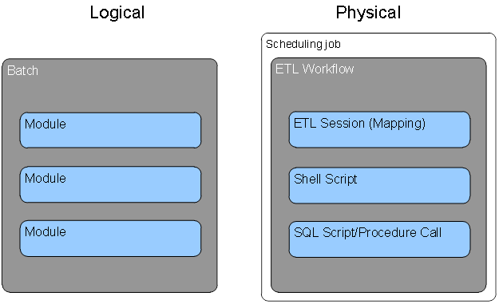
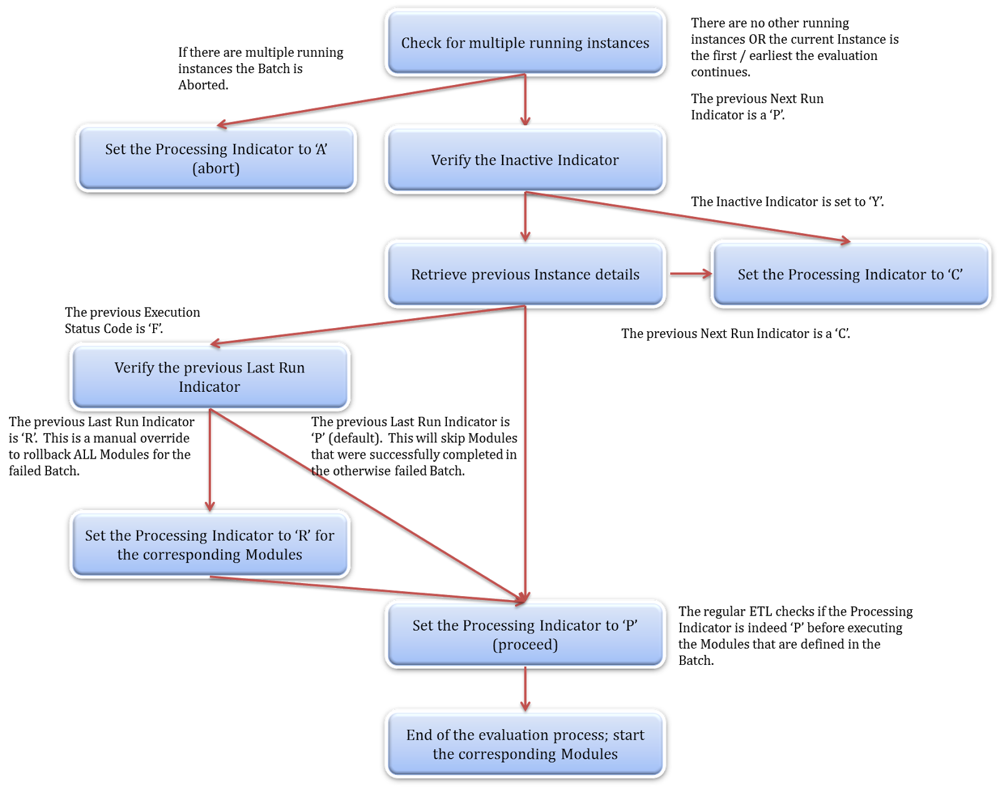

# Introduction of DIRECT
DIRECT, the Data Integration & Execution Control Tool, is a data integration control and execution metadata model. It is a core and stand-alone component of the Data Integration Framework. 

Every Data Integration / Extract Transform and Load (ETL) process is linked to this model which provides the orchestration and management capabilities for data integration. 

Data Integration in this context is a broad definition covering various implementation techniques such as ELT (Extract Load, Transform - pushdown into SQL or underlying processing) and LETS (Load-Extract-Transform-Store). 

Data Integration in this document essentially covers all processes that 'touch' data.

The DIRECT repository captures Data Integration process information, and is an invaluable source of information to monitor how the system is expanding (time, size) but also to drive and monitor processes - a fundamental requirement for parallel processing and transaction control.

The objective of the DIRECT Framework is to provide a structured approach to describing and recording Data integration processes that can be made up of many separate components. This is to be done in such a way that they can be represented and managed as a coherent system. 
# Overview
This document covers the design and specifications for the DIRECT metadata repository and the integration (events) for data integration processes. 

The DIRECT framework covers a broad variety of process details, including (but not limited to):

* What process information will be stored and how.
* How a process is integrated into the various defined Layers and Areas.
* Of what entities the metadata model consists,
* The available procedures for managing the data solution.
* Concepts and principles.
* The logic which can be used to control the processes.
* Housekeeping functions.
* Reporting.

The position of the control and execution framework in the overall architecture is:


 
# Concepts
## Purpose

The process control framework supports the ability to trace back what data has been loaded, when and in what way for every individual data integration process. 

Any single data element (e.g. attribute value in a table) should be auditable. It should be possible to track the what processes have been run that has led to the visible result.

This means that the following information must be available:

- When a record was inserted.
- When a record was updated.
- What the source was where the record originated from.
- When the event took place that changed the source data.
- Which process has loaded the data .
- Within which workflow the data was loaded.
- Which platform the process took place.

## Elements of process information

While the physical components involved in the end-to-end ETL process can vary in scope and can employ a range of technologies, the framework provides a logical layer of abstraction so that a consistent view of the workflow can be visualised, maintained and reported.

At the core of the framework is a logical model for describing units of work. All ETL processes executing within the Data Warehouse environment conform to this basic two-level hierarchy.
* **Batch** – contains a group of executable elements. This group typically applies to a single Layer and single Area but not necessarily so.  A Batch can be defined to fit any purpose by organising any available Module.
* **Module** – the smallest executable unit. By definition of the structuring of ETL processes, a Module may only apply to a single Area of the Outline Architecture.
In order to simplify the association of logical units of work and their physical counterparts the physical component model also conforms to a simple two level hierarchy.
* A Batch equates to an ETL workflow object and only an ETL workflow object. 
* A Module can be an ETL process (Mapping, Package), an Operating System shell script or a SQL script (procedure call).

The following diagram illustrates the logical and physical models for units of work:



## Orchestration
The sequencing and submission of modular work units is controlled by two different technologies. Batches are controlled by the enterprise scheduling tool according to the execution plan defined within that environment. The modules within a Batch are sequenced by the ETL engine.

In this way it is not possible for a Batch to initiate a Module other than those defined within it nor is it possible for a Module to invoke a Module other than those within its own Batch. Batches are initiated only by the completion of another Batch and only at the direction of the scheduling software.

Modules are initiated only through the completion of another Module within the same Batch and are not scheduled directly in the scheduling tool. 

The following figure illustrates the end-to-end orchestration structure for Batches and their Modules:


## Instantiation
The repository is required to record the execution status and history of the defined ETL processes as and when they are invoked. Dedicated data entities are provided for the recording of work unit executions or instances:
*	Each execution of a Batch results in a Batch Instance.
*	Each execution of a Module results in a Module Instance.

Each instance created is assigned a unique identifier used to tag its output and so allow the system and its users to identify the effects of a discrete component execution. If a Batch or Module is run more than once (due to restarting or re-running) a new instance record is created in order to provide full execution history.

The following figure describes how a static Batch/Module definition creates run-time instances of itself.


## Parameters
The framework provides for the definition of parameters and their association with defined Modules. The framework allows the ETL processes to use these parameters at run-time (depending on the ETL software used). Any parameter defined as global is used by all Modules.

## Logical model
The concepts and principles described so far in this document form the basis of the DIRECT data model. The  data entities required to describe the core concepts are described by the following Entity Relationship model:


## Execution layers
There is a range of technologies and tools involved in the invocation and tracking of modular work units. Logical control is passed between the layers as follows:
1. The scheduling tool invokes the next job (Batch) in its plan/schedule. This may involve executing a common wrapper script or series of events.
1. The repository is consulted for the execution syntax of the nominated Batch and creates a new Batch Instance if required.
1. The newly created Batch Instance is executed and the system awaits a response.
1. The Modules defined within the Batch are called in turn with each creating and updating its own Module Instance.
1. After the Module Instances have been run the control is returned to the repository and the Batch Instance will be updated to reflect completion or failure.
1. The scheduling job is complete and free to invoke the next job in the plan.

The following diagram illustrates the layers and technologies involved in this process:


## Rollback and re-processing
When processing errors occur (a data integration process fails), relevant information about the failure is recorded in the repository by the framework. This information can be used to recover from data loading errors and set the data solution back into the original state prior to the occurrence of the error. 

This 'rollback' can be configured at both Batch and Module level. 

By default, a Module is configured to check if there are earlier erroneous runs upon execution. If this is the case, for example when the previous Module Instance for the Module has an Execution Status Code set to 'F', the *running* Module Instance will roll back any data associated with these earlier erroneous instances. 

Similarly, in the standard configuration a Batch will also look into previous Batch Instances to see if failures have occurred. However, the Batch does not instigate a rollback directly. Rather, the Batch Instance will skip any earlier successfully completed Module Instances and retry the failed Module Instance(s).

This process can be overridden by setting the Next Run Indicator of the Batch Instance to 'R' (rollback). If this value is set, the Batch Instance will rerun all Modules defined within the Batch.

At runtime, information about earlier failed instances is presented as arrays of the relevant Batch and Module Instance Identifiers. The type of recovery depends on the type of data model but typically leads to DELETE and UPDATE statements on one or more tables. This specifies that ETL should be able to be rerun and recovery failed attempts.

The following is a high level overview of the reprocessing strategy. These actions are implemented as part of the Batch and Module Evaluation events (described in the next section):
* **Staging Area** ; the target table is truncated. This essentially is a redundant step because the Staging Area is truncated by the Module Instance but the step is added for consistency reasons and to be on the safe side for reprocessing
*	**Staging Area** ; if the Source Control table is implemented this information is corrected by deleting the entries that were inserted by the failed Module Instances
*	**Persistent Staging Area** ; all records that have been inserted by the failed Module Instances are deleted. Due to the default (mandatory) structure of the History Area tables only the delete statement is sufficient
*	**Integration Layer** ; rollback varies depending on the type of model but rollback usually is a combination of inserts and deletes depending on the types of tables in the Data Warehouse (in turn dependent on the data modelling technique). An example of recovery using Data Vault is added below:
    * Hub table: deletion of all records inserted by the Module Instance. 
    *	Link table: deletion of all records inserted by the Module Instance.
    *	Satellite table: deletion of all records inserted based on the Insert Module Instance ID attribute. Also included is an update of all records to set these to be the active record again (repair timelines) using the Update Module Instance ID information

The Interpretation Area, Helper Area and Reporting Structure Area typically use a strategy similar to the ones used on the previous steps but can be custom defined to suit the (reporting) purpose. Custom rollback approaches are documented in Implementation Patterns for the corresponding purpose. 
# Design
The physical implementation of the framework requires the development of components in three distinct areas:
1. The repository database
1. The events; the scripts and functions representing the framework logic
1. Housekeeping and supporting components

## Repository database
The data model for the process control framework contains all involved entities, attributes and their descriptions. The model also contains content for the various tables including (reference) values for the Layers, Areas and code tables such as Frequency and Severity.

Table | Description
----- | -----
AREA	| The Area table contains the list of architecture areas as defined in the reference architecture (of the Data Integration Framework). This information is queried by the framework during Module execution to prepare rollback information if required. The Area is the most detailed classification of ETL processes in the ETL Framework. By defining the Area and specific settings on Module level (through naming conventions) the rollback queries can be created dynamically. 
BATCH	| The Batch table contains the unique list of Batches as registered in the framework. To be able to run successfully each Batch must be present in this table with its own unique Batch ID. Batch IDs are generated keys. 
BATCH_INSTANCE	| At runtime, the framework generates a new Batch Instance ID for the Batch execution. This information is stored in this table along with ETL process statistics. The Batch Instance table is the driving table for process control and recovery as it contain information about the status and results of the Batch run.
BATCH_MODULE |	The Batch Module table contains the relationships between batches and modules. It is a many-to-many relationship, i.e. one Batch can contain multiple Modules, and one Module could be utilised by multiple Batches
EVENT_LOG	| The Event Log table is a generic logging table which is used to track and record events that happen during ETL execution. The Event Log table can contain informative details (i.e. ‘Batch Instance was created’) or information related to issues or errors provided by the ETL platform. 
EVENT_TYPE	| The Event Type table contains descriptive information about types of events or errors for reporting purposes, such as process logs, environment related issues, and custom defined errors or ETL process errors.
EXECUTION_STATUS	| The Execution Status table contains descriptive attributes about the Execution Status codes that the framework uses during the ETL process. 
LAYER	| The Layer table contains the list of Layers as defined in the ETL Framework Outline Architecture. Unlike the Areas this information is not queried during Module execution and is purely descriptive for use in reporting. The Layer is the higher level classification of ETL processes in the ETL Framework. 
MODULE	| The Module table contains the unique list of Modules as registered in the framework. To be able to run successfully each Module must be present in this table with its own unique Module ID. Module IDs are not generated keys and are consistent across environments and represent a single ETL process.
MODULE_INSTANCE	| At runtime, the framework generates a new Module Instance ID for the Module execution. This information is stored in this table along with ETL process statistics. The Module Instance table is the driving table for process control and recovery as it contain information about the status and results of the Module run. The generated Module Instance ID is stored in the target tables for audit trail purposes. It also contains additional runtime details including the number of rows read (selected), updated, inserted, deleted, updated, discarded or rejected.
MODULE_PARAMETER	| The Module Parameter table creates a relationship between specific parameters and the Modules for which they are applicable. It is best practice to ‘register’ the Modules that require certain parameters in their processing using this table. 
NEXT_RUN_INDICATOR | The Next Run Indicator table contains descriptive attributes about the Next Run Indicator codes that the framework uses during the ETL process.
PARAMETER	| The Parameter table provides the option to define parameters that can be queried by custom code in the ETL process. This can include (but not limited to!) flags (Initial Load Y/N) or tracking date ranges for moving loading windows into the Presentation Layer.
PROCESSING_INDICATOR | The Processing Indicator table contains descriptive attributes about the Processing Indicator codes that the framework uses during the ETL process.
SOURCE_CONTROL |	The Source Control table is used in source-to-staging interfaces that require the administration of load windows. Examples are CDC based interfaces, pull-delta interfaces or when only a certain range from a full dataset is required but all data is provided. It is designed to track the load window for each individual Module.

## Events
In order to provide a common, reusable means of interacting with the repository the framework includes a number of processes which collectively serve as the logic tier. The implementation of these events varies depending on the ETL software used in the various projects. This information is captured using Implementation Patterns, documenting how these concepts can be implemented using specific software. The following events, or functions, are defined as part of the framework:
*	Create Batch Instance; initiates a new Batch Instance for the existing Batch. This creates a new Batch Instance ID, related to the Batch
*	Batch Evaluation (‘Batch Eval’); handles sanity checks, exception handling and recovery for the Batch Instance
*	Batch Success; updates the repository to indicate successful completion of a Batch Instance process
*	Batch Failure; updates the repository to record failure and relevant information when an error occurs when processing the Batch Instance
*	Batch Abort; updates the repository when the Batch Instance processing has been aborted due to integrity issues (identified during the Batch Evaluation)
*	Batch Skip; updates the repository when the Batch Instance run has been skipped. This is an option within the framework to prevent a Batch to be run when it is set to inactive or to skipped by the previous run
*	Create Module Instance; initiates a new Module Instance for the existing Module. This creates the new Module Instance ID in OM.
*	Module Evaluation (Module Eval); performs the integrity checks for the new Module Instance and manages any reprocessing related to errors in previous related Module Instances that may be present
*	Module Success; updates the repository to record successful completion of a Module Instance
*	Module Failure; updates the repository to record failure in processing the Module Instance
*	Module Abort; aborts the Module Instance processing due to inconsistencies in the repository
*	Module Skip; this event skips the current processing of the Module Instance. This is recorded in the repository for the Module Instance, but no physical ETL processing (logic) will be executed
*	Write Event; this event or function is used to access the EVENT_LOG table for status updates

## Codes and events

DIRECT defines Modules as small (atomic) ETL processes and Batches as a combination or series of Modules to be run in coherence. The framework defines how these concepts integrate with and impact each other. To manage these processes both the Batch and Module Instance tables maintain a set of three operational code fields which together govern the way the metadata layer executes and directs the ETL flow.

These codes or flags are:

- Execution Status Code; monitors the outcomes of the ETL process.
- Processing Indicator; provides the mechanism for internal process control.
- Next Run Indicator; provides information about how the ETL should operate on the next run, based on current information.

Both Batch Instances (signifying one single execution of an ETL workflow) and Module Instances (signifying one single execution of an ETL process) use these flags in the same manner. During the captured events, and in particular during the Module and Batch Evaluation event, the framework performs various checks to verify the data in the process control subsystem.

These checks are:

- Check if there are no additional running Instances, save the current running Instance. A Module or Batch must complete before it can be run again
- Check if rollback / data recovery is required
- Check if the Batch is executed in compliance with its frequency settings

### Execution Status Code

Of the three code fields, the execution status summarises the (Module / Batch) Instance's processing and as such is the main operational indicator. Although there are exceptions, in most cases the status of an Instance will always be either Executing, Failed, or Succeeded. The Execution Status Code is completely driven by the process framework subsystem and should not be altered ('read only'). 

After proper testing and deployment all runs should complete successfully (Execution Status Code equals 'S'). An overview of severity is shown in the following diagram:


The detailed code purpose is defined in the following table

| Code | Value     | Description                                                  |
| ---- | --------- | ------------------------------------------------------------ |
| E    | Executing | The ETL instance is currently running (executing). This is only visible while the ETL process is actually running. As soon as it is completed this code is updated with one of the possible values below. |
| S    | Succeeded | The instance is no longer running after successful completion of the process. |
| F    | Failed    | The instance is no longer running after completed with failures. |
| A    | Aborted   | An abort is an attempted execution which led to the instance unable to start. Abort means that the process did not run, but was supposed to. This is typically the result of incorrect configuration or race conditions in the orchestration. The most common reasons for an abort in the ETL execution are:<br /><br />There is already another instance of the same Batch or Module running. The same logical unit of processing can never run more than once at the same time to maintain data consistency. If this situation is detected the second process will abort before any data is processed.<br /><br />The Module (Instance) was executed from a parent Batch (Instance) but not registered as such in the Batch/Module relationship. |
| C    | Cancelled | The cancelled (skipped) status code indicates that the instance was attempted to be executed, but that the process control framework found that it was not necessary to run the process. <br /><br />This can be due to Modules or Batches being disabled in the framework using the 'inactive indicator'. Disabling processes can be done at Batch, Batch/Module and Module level.<br /><br />Another common scenario is that, when Batch (workflows) are restarted, earlier successful Modules in that Batch will not be reprocessed. These Module Instances will be skipped / cancelled until the full Batch has completed successfully. This is to guarantee completeness in data (prevention of data loss). |

### Processing Indicator

The Processing Indicator directs the actions of the instance, what the instance is allowed to do next. 

Because there are a number of components which may be applied across different technologies, this indicator is used to share processing directions between them. For example Oracle uses stored procedures to control its processing, while software such as Informatica Powercenter can execute mappings and workflows.

The Processing Indicator is the outcome of the Module (or Batch) Evaluation Event. This is an evaluation process that runs before the execution of Instances and the Processing Indicator is the information that the control framework provides based on the evaluation steps. 

Similar to the Execution Status Code this is a 'read only' attribute.

| Code | Value    | Description                                                  |
| ---- | -------- | ------------------------------------------------------------ |
| P    | Proceed  | The Instance can continue on to the next step of the processing. This is the default processing indicator value; each process step will evaluate the Process Indicator and continue only if it was set to 'P'. After the pre-processing has been completed the 'P' value is the flag that is required to initiate the main ETL process. |
| A    | Abort    | This exception case indicates that the Instance in question was executed, but that another Instance of the same Batch or Module was already running (see also the equivalent execution status code for more detail). This is one of the sanity checks performed before the regular ETL (Module and Batch) can continue. If this situation occurs, all processing should stop; no data should be processed. The process will use the Processing Indicator 'A' to trigger the Module/Batch 'Abort' event which sets the Execution Status Code to 'C', ending the process gracefully. |
| C    | Cancel   | That the evaluation process has determined that it is not necessary to run this ETL process (see also the equivalent execution status code for more detail). As with the Abort, if the process indicator is Cancel then all further processing should stop after the Execution Status Code has been updated to 'C' |
| R    | Rollback | The indicator for rollback is only set during rollback execution in the Module Evaluation event. This is essentially for debugging purposes. After the rollback is completed the Processing Indicator will be set to 'P' again to enable the continuation of the ETL. |

### Next Run Indicator

The Next Run Indicator is used to pass processing directions between instances of the same entity (Module or Batch).

The primary function of this code field is to direct the rollback functionality; if an instance fails then the Next Run Indicator will be set to 'Rollback', which means that an event can be called to remove inserted data directly, or as part of a next instance execution.

| Code | Value    | Description                                                  |
| ---- | -------- | ------------------------------------------------------------ |
| R    | Rollback | When a current (running) Instance fails the Next Run Indicator for that Instance is updated to 'R' to signal the next run to initiate a rollback procedure. At the same time, the Execution Status Code for the current Instance will be set to 'F'.<br /><br />Administrators can change the Next Run Indicator value for an Instance to 'R' if they want to force a rollback when the next run commences. |
| P    | Proceed  | The Proceed value 'P' will direct the next run of the Batch/Module to continue processing. This is the default processing indicator value; each process step will evaluate the Process Indicator and continue only if it was set to 'P'. After the rollback has been completed the 'P' value is the flag that is required to initiate the main ETL process. |
| C    | Cancel   | Administrators can manually set this code to for the Next Run Indicator (i.e. this will not be automatically set by the DIRECT controls) to force a one-off skip of the Instance. |

## Event integration

Not all Event Handling logic can be captured in generic events and ETL processes themselves also have some integration requirements in order to successfully run within the  Framework. The technical implementation can vary between ETL software but is different on Batch and Module level.

### Batch Level Integration
Ultimately, the correct calling of the events is orchestrated from the ETL process which acts as the Batch. This ETL process must perform the following tasks:
*	The Batch Instance Start Date Time is generated as soon as processing commences, even before the Batch Instance itself has been created
*	Batch information is queried to prepare calling the  Create Batch Instance event. This information (Batch ID and Frequency Code) is available in the BATCH table. 
*	The Create Batch Instance event is called, using the Batch ID. This event creates a new Batch Instance ID
*	With the Batch Instance ID being available the Batch Evaluation event is called. This event ultimately updates the PROCESSING_INDICATOR attribute for the Batch Instance (in the BATCH_INSTANCE table) and returns this indicator for use in the Batch ETL process. It also set the NEXT_RUN_INDICATOR for Module Instances belong to current Batch if a rollback was needed.
*	The Batch Instance processing interprets the Processing Indicator value and, depending on the value, calls the Batch Skip event (Processing Indicator returns a ‘C’ value for cancellation / skipping) or the Batch Abort event (Processing Indicator returns an ‘A’ value for abortion of the process). If the evaluation was done without finding any issues the Batch Evaluation will have returned a ‘P’ value for the Processing Indicator and the Module Instances of the Batch Instance can commence processing
*	After all Module Instances have been completed successfully, the Batch Success event is called
*	If, at any stage, an error is encountered in either the Batch Instance or any of the Module Instances associated with the Batch Instance the Batch Failure event is called

This process is displayed in the following diagram:


#### Detailed Batch integration steps

The DIRECT Batch-level events are documented at a more detailed level below:

1. Set the Batch Instance Start Date Time; i.e. the time when the Batch (Instance) started

2. Retrieve the Batch Information. Based on the Batch Code (the name of the parent workflow or process), the Batch ID and Frequency Code are retrieved from the BATCH table.  The Frequency Code is used for Batch Evaluation later in the process

3. Create new Batch Instance (Batch Create Instance event). This step inserts a new record in the BATCH_INSTANCE table based on the Batch ID with the:

   * Execution Status Code as 'E' (Executing)
   * Processing Indicator as 'A' (Abort)
   * Next Run Indicator as 'P' (Proceed)
   * Start Date/Time as the Batch Instance Start Date

4. <ol type="a"><li></li></ol>

5. These values will be changed depending on how the rest of the DIRECT housekeeping proceeds. The 'A' code for the Processing indicator acts as a safety net for the unlikely event that the DIRECT subsystem fails. In other words the approach is to abort (soft error) the load until the Batch evaluation is completed correctly. The Processing Indicator will be updated as part of the Batch Evaluation event

6. Conceptually, as part of the Batch Create Instance Event, the new Instance ID is generated. The Batch Instance ID must be retrieved for further processing. The query to identify the Instance ID is as follows:

   ```sql
   SELECT BATCH_INSTANCE_ID, PROCESSING_INDICATOR
   FROM BATCH_INSTANCE
   WHERE EXECUTION_STATUS_CODE = 'E'
   AND BATCH_ID = <the Batch ID>
   ```

7. Evaluate the current Batch Instance (Batch Evaluation event). Similar to the Module Evaluation this event performs sanity checks and housekeeping for the framework on Batch level. If the evaluation finishes successfully and no issues have been encountered the Processing Indicator will be set to 'P' (proceed) and the Modules can be started (instantiated). The Batch Evaluation verifies a number of scenarios and sets the Processing Indicator accordingly

#### Batch evaluation event

An overview of the Batch Evaluation steps is displayed in the following diagram:


The process is as follows:

1. Check for multiple running instances; Batches are not allowed to run in parallel; the next Batch can only start if the previous one has been completed. If there are more running instances for the same Batch the current / new Instance is 'aborted'.

2. If the current Instance is the only running Instance the process continues. This information is queried as follows:

   ```sql
   SELECT COUNT(*) as ActiveInstancesCount
   FROM BATCH_INSTANCE
   WHERE EXECUTION_STATUS_CODE = 'E'
     AND BATCH_ID = ?
     AND BATCH_INSTANCE_ID < ?
   ```

3. Verify the Inactive Indicator. Only the Batch level indicator requires to be checked. If the Inactive Indicator is set to 'Y' the running Instance will be skipped.

4. Retrieve previous Instance details. The Next Run Indicator and the Execution Status Code set by the previous Instance sets the behaviour for the running one. The following scenarios are possible:

   * If the previous (Batch) Next Run Indicator indicates 'C' (Cancel / Skip) this means that the Batch was manually set to inactive for the single run and the Processing Indicator for the current Instance will be set to 'C'. This will be further handled by the Batch Skip Event which will close the Instance and set the Execution Status Code to 'C' as well during this process.
   * If the previous (Batch) Execution Status Code is 'F' this means the previous Batch has failed and the rollback process is initiated

5. Rollback. The default rollback mechanism skips Modules that have successfully completed in a Batch Instance that ultimately failed. This way, no ETL is reprocessed without there being a reason for it. However, the administrator can set the Next Run Indicator manually to 'R' to force a full rollback for all Modules associated with the Batch.

   * If the previous (Batch) Next Run Indicator indicates 'R' the rollback process is performed on all Modules (regardless of the Module's Next Run Indicator). Rollback is then executed further on the Module level through the Module Evaluation. This is implemented by overriding the individual Module Instances for recovery (Next Run Indicator  = 'R' on Module level).
   * If the previous (Batch) Next Run Indicator indicates 'P' the Modules that were completed successfully are set to be skipped the next time the Batch runs. This is implemented by overriding the Next Run Indicator on Module level to 'C' which is further handled by the Module Evaluation.

6. After the rollback process, or in the case there were no previous failures, the Evaluation is completed and the Processing Indicator is set to 'P'. This is the safety catch for the Modules to start. The Modules are individually executed in the order as directed by the Batch

   * If at this point the Processing Indicator is 'C' (as determined during Batch Evaluation, the Batch will be skipped (Batch Skip/Cancel event).  Similar to the above, in this scenario multiple runs have been detected and one of the running workflows (the current one) is aborted but there is no reason not to restart normally next time, so the Next Run Indicator is set to 'P'.
   * Similarly, if the Processing Indicator is 'A' the Batch will be aborted (Batch Abort event).
   * As mentioned, if the Processing Indicator is 'P' the subsequent sessions (Modules) will start. No Modules are allowed to start unless this indicator equals 'P'.

7. Post-processing. The following scenarios are possible:

   * After all Modules have been completed without any issues the Batch Success event will update the Batch Instance to set the (Batch) Execution Status Code to 'S' (success), the (Batch) Next Run Indicator as 'P' and the current date/time as the End Date/Time.  This indicates that the Batch has been completed successfully and can be run normally next time. For Modules 'no issues' in this context means that Modules have received anything but the Execution Status 'F'.
   * If a failure is detected at any time during this process the Batch Failure event is initiated. This event sets the (Batch) Execution Status Code to 'F' which is used to drive rollbacks on Module level the next time the Batch is initiated. Any meaningful information will be logged to the EVENT_LOG table.

### Module level integration

Every Module needs to access the repository using the defined events. The integration on Module level ensures that every single ETL process is logged correctly and is able to use the available parameters. Modules that do not adopt this integration risk the integrity of the Data Warehouse. By design, if any issues arise when accessing the repository or using the events the ETL logic (ETL mapping) will not start. To allow for reprocessing the metadata is queried as well, ensuring that every Module can be run at any time without corrupting information.
The following process is followed:

*	The Module Instance Start Date Time is generated as soon as processing commences, even before the Module Instance itself has been created
*	Module information is queried to prepare calling the Create Module Instance event. This information (Module ID, Area Code and Table Code) is available in the MODULE and DATA_STORE table (linked by MODULE_DATA_STORE table) and is important for further processing; most notably the recovery mechanism.
*	The Create Module Instance event is called, using the Module ID. This event creates a new Module Instance ID
*	With the Module Instance ID being available the Module Evaluation event is called. This event ultimately updates the PROCESSING_INDICATOR attribute for the Module Instance (in the MODULE_INSTANCE table) and returns this indicator for use in the Module ETL process. During this step any required housekeeping activities such as rollbacks are executed.
*	The Module Instance processing interprets the Processing Indicator value and, depending on the value, calls the Module Skip event (Processing Indicator returns a ‘C’ value for cancellation / skipping) or the Module Abort event (Processing Indicator returns an ‘A’ value for abortion of the process). If the evaluation was done without finding any issues the Module Evaluation will have returned a ‘P’ value for the Processing Indicator and the Module Instance can commence processing
*	After the Module Instance has been completed successfully, the Module Success event is called
*	If, at any stage, an error is encountered in the Module Instance the Module Failure event is called


#### Detailed Module integration steps 

The Module level events are detailed below:

1. Set the Module Instance Start Date Time; i.e. the time when the Module (Instance) started.

2. Retrieve the Module Information. Based on the name of the ETL process as defined in the ETL platform, the Module Code, the Module ID is retrieved from the MODULE table. This means the process name is hard-coded for each individual ETL process and must be properly registered in DIRECT; pre-populated in the MODULE table. Other relevant information from MODULE such as the Area Code and Table Name is also retrieved at this stage for later use in the rollback process

3. Create a new Module Instance (Module Create Instance event). With the available information a new Module Instance can now be created with the:

   1. Execution Status Code as 'E' (Executing).
   2. Processing Indicator as 'A' (Abort).
   3. Next Run Indicator as 'P' (Proceed).
   4. The Start Date Time will be set as the Module Instance Start Date Time as set in step 1

4. This is an insert into the MODULE_INSTANCE table. The 'A' code for the Processing indicator acts as a safety net for the unlikely event that DIRECT fails while pre-processing. In other words the approach is to abort (soft error) the load until the Module evaluation is completed correctly. The Processing Indicator will be updated as part of the Module Evaluation event.

5. It must be possible to run Modules (mappings) individually (i.e. without a parent Batch):

   1. If the Module was initiated from a Batch process, the Batch Instance ID is inherited from the parent Batch Instance.
   2. If the Module is run without a Batch, for instance while troubleshooting or testing the Batch Instance ID will be 0 (zero).  This is typically a situation encountered in a development setting.

6. The action to retrieve the Module Instance ID as created by the previous step is conceptually part of the Create Instance Event but the technical implementation depends on the ETL and/or database capabilities (i.e. using sequence generators).

7. The query to identify the Instance ID is as follows:

   ```sql
   SELECT MODULE_INSTANCE_ID
   FROM MODULE_INSTANCE
   WHERE EXECUTION_STATUS_CODE='E'
     AND MODULE_ID= <the retrieve Module ID>
     AND START_DATETIME = <the initial Module Instance Start Date Time>
     AND BATCH_INSTANCE_ID= <the inherited Batch Instance ID or 0 (zero)>
   ```

8. The Module ID, Execution Status Code (for that Module) and Batch Instance ID are required since Modules can be potentially be executed in parallel from different Batches and it is required that DIRECT is able to select the correct running Instance. In this scenario the Module Evaluation event will 'Abort' all Instances after the first of the parallel Instances based on the Module Instance ID value (which is a sequenced attribute).

9. In other words; the earliest instance will be allowed to continue to run, but all others will abort.

10. Evaluate the current Module Instance (Module Evaluation event). This event performs the sanity checks and housekeeping for the framework on Module level. It is the most complex part of the pre-processing.

#### Module evaluation event

The following diagram highlights the evaluation actions:



The process is as follows:

1. Check for multiple running instances; if there are more running instances for the same Module only the first one is allowed to continue, the other active Instances must be aborted. This means that the current in-progress Module Instance for which the check is done needs to query if it itself is in the earliest (MIN) of the set of active Instances for the same Module. If this is true the Instance can continue, otherwise it will be flagged to be aborted (Processing Indicator 'A')

2. This value in of the Processing Indicator will trigger an update of the MODULE_INSTANCE table to set the Execution Status Code to 'A' for the current Instance and avoid executing of the regular ETL logic

3. Validate Batch Execution. DIRECT will query the Batch information to validate if the Module was registered properly (i.e. contains an entry in the Batch/Module relationship table) when instantiated from a Batch. This check also takes into account the value of the Inactive Indicator on Batch/Module level

4. If this value is set to 'Y' the current Instance will be skipped as this indicates the Module is disabled for the particular Batch

5. Retrieve Previous Instance details. If allowed to continue the Module Evaluation then checks if the previous run(s) have failed or not. It will select the Next Run Indicator value from the previous Module Instance to direct the internal processing. If a failure is detected (the status of the previous instance Next Run Indicator is 'R') this step will create an array of all Module Instances from the last logged successful run to the most recent (failed) run

6. This effectively selects multiple failed runs for rollback from the point where the run was last successful. This array of (failed) Module Instances will ultimately be used as the 'IN' clause of the Rollback SQL

7. Based on the result of this check the following scenarios are possible:

   * If the previous (Module) Next Run Indicator is 'C' (skip / cancel) the run will be finished before the actual ETL starts. This can happen if:
     * The system administrator has labelled this Module to be disabled for this run by manually setting the Next Run Indicator value to 'C' in the Module Instance. 
     * The previous Batch failed but the specific Module (Instance) was run successfully in that particular Batch and is skipped when the Batch is run again (rollback on Batch level)

   * If the previous Module Next Run Indicator is 'R' (rollback) the rollback process is started (see Rollback section). The Rollback process uses the Area Code and Table Name to create dynamic SQL statements. After the rollback SQL has been executed correctly the Processing Indicator is set to 'P' and processing will continue as usual.

8. The Module Evaluation effectively returns the Processing Indicator for the current Module Instance. The next step for the processing is to interpret this indicator for the current Module Instance to either stop or continue the processing

9. After the Module Evaluation is complete and the Processing Indicator equal 'P' the regular ETL process can be executed. In other words, no regular processing is allowed unless this indicator is 'P'.  This is the safety catch for the Module to start.

   * If at this point the (Module) Processing Indicator is 'C' the Module Instance record is updated to set the final Execution Status Code to 'C' and the End Date/Time to the current date/time value (sysdate, getdate or equivalent).
   * If at this point the (Module) Processing Indicator is 'A' the Module Instance record is updated to set the final Execution Status Code to 'A' and the End Date/Time to the current date/time value (sysdate, getdate or equivalent).
   * As mentioned, if the Processing Indicator is 'P' the real ETL logic will be executed. No Modules are allowed to start unless this indicator equals 'P'

10. Post-processing. After the ETL logic has completed without any issues, the Processing Indicator of the Module Instance is checked.

11. The following scenarios are possible:

    * If the (Module) Processing Indicator is 'C' the Module Instance is updated with the Execution Status Code set to 'C', the Next Run Indicator as 'P' and the current date/time as the End Date/Time. This is the Module Skip event.
    * If the Processing Indicator is 'A' the Module Instance is updated with the Execution Status Code set to 'A', the Next Run Indicator as 'P' and the current date/time as the End Date/Time. This is the Module Abort event.
    * If the Processing Indicator is 'P' and the ETL runs without issues the Module Instance is updated to set the Execution Status Code to 'S' (success), the Next Run Indicator as 'P' and the current date/time as the End Date/Time. As a separate step the record counts are updated in the MODULE_INSTANCE table.
    * If a failure is detected at any time during the process (i.e. either Module start or end process), the Module Failure event is initiated. This event sets the Execution Status Code to 'F' and the Next Run Indicator to 'R' for the current Instance.  Any meaningful information will be logged to the EVENT_LOG table.

### Rollback processes

The default rollback procedures are essentially SQL queries that are dynamically created by the process control framework, although they can be swapped with other events, procedures or services as well. 

The exact syntax and details can vary between deployments and depending on naming conventions, modelling techniques and technical environments. For this purpose, the rollback is a configurable component. 

In all cases, the rollback procedure depends on consistency of the Batch definition (i.e. all Modules in a Batch Instance must be completed). The following inputs are required:

- The <Table Type> is retrieved via the relationship between the Module and the (target) table in the MODULE_DATA_STORE repository table. 
- The <Instance Array> is constructed in the Module Evaluation event based on the information of previous (failed) Instances. 

Both variables can be passed into the rollback process from DIRECT. Examples of how rollback processes work are listed below.

#### Rollback through truncation

The most straightforward approach to support rollback is through truncation. This can apply to various non-historised tables such as Staging Area tables. 

The <Table Code> variable is available in DIRECT and can be used to dynamically generate queries to truncate the target, for example:

```sql
/* Truncation */
TRUNCATE TABLE <Table Code>

/* Deletion */
DELETE FROM SOURCE_CONTROL WHERE MODULE_INSTANCE_ID IN (<Instance array>)
```

#### Rollback on historised / time-variant tables

Historised tables make up the majority of a typical data solution. Because these persist the recorded changes over time, they can't simply be truncated in many cases. 

A delete statement is usually sufficient in this case.

```sql
DELETE FROM <Table Code> WHERE INSERT_MODULE_INSTANCE_ID IN (<Instance array>)
```

If the target table also has end-dating (effective dating) applied, an update statement is required as well to reset or recalculate the expiry date/times. For example:

```sql
UPDATE <Table Code>
SET EXPIRY_DATE='9999-12-31', CURRENT_RECORD_INDICATOR='Y'
WHERE INSERT_MODULE_INSTANCE_ID IN (<Instance array>)
```

#### Rollback for source control

It may be required to rollback load window / source control tables in line with regular tables. Some ETL processes use 'high water mark' or 'load window' mechanism that control what data delta is processed from one place to another.

If a rollback impacts a table associated with the source control logging table in DIRECT, the rollback needs to be extended to make sure the load window is reset as well.

```sql
DELETE FROM SOURCE_CONTROL WHERE MODULE_INSTANCE_ID IN (<Instance array>)
```

In other approaches, an option is to retain the load window until all related (Batch) processes have been successfully completed.

#### Rollback at Batch level

Batch processes do not have specific instances that can be rolled-back, because the (real) execution of logic only happens at Module level. Rolling back Batch processes (via the Rollback indicator) will trigger impacted Modules to run again.

# Registration - adding new processes to DIRECT
It is essential that any new ETL object (Batch, Module, Data Store and Parameter) and the relationship have to be added to the static repository tables before execution.  This is going to be later on part of the standard procedure during development as more and more batch and modules are created. 

As these new objects are tested and then moved from one environment to another, the same details should be populated in the static repository tables except for the environment details.

### Batch registration
The Batch registration is done by adding a record in the BATCH table with the following details:
*	BATCH_ID; this is a system generated surrogate ID that is used to unique identify a Batch
*	BATCH_CODE; this is the name of the Batch (workflow name, parent package; depending on the ETL software used)
*	FREQUENCY_CODE; indicates how often the Batch can be run (for instance daily, hourly, weekly). It is usually a descriptive code only as the running interval for the ETL process is normally managed by external scheduling tool like Control-M or the build-in scheduling tool of the ETL software. When necessary, the Frequency Code can be used during the Batch Evaluation event, to evaluate the running interval and decide whether a batch should be run
*	BATCH_DESCRIPTION; the descriptive information of the Batch
*	INACTIVE_INDICATOR; indicate whether a Batch is inactive and should be skipped in the ETL process

### Module registration

The Module registration is done by adding a record in the MODULE table with the following details:
*	MODULE_ID; this is a system generated ID that is used to unique identify a Module
*	AREA_CODE; the Area as part of the Outline Architecture where the Module is part of. This identifies the type, template and purpose of the Module
*	MODULE_CODE; this is the name of the Module (mapping name, child package; depending on the ETL software used)
*	MODULE_TYPE_CODE; the type of Module (script, specific ETL job, etc.)
*	MODULE_DESCRIPTION; the descriptive information of the Module
*	INACTIVE_INDICATOR; indicate whether a Module is inactive and should be skipped in the ETL process.

### Data Store registration

The Data Store registration is done by adding a record in the DATA_STORE table with the following details:
*	DATA_STORE_ID; this is a system generated surrogate ID that is used to unique identify a Data Store
*	DATA_STORE_CODE; this is the name of the Data Store (table name, file name; depending on the type of the data store)
*	DATA_STORE_TYPE_CODE; the type of Data Store (table, flat file, etc.)
*	DATA_STORE_DESCRIPTION; the descriptive information of the Data Store
*	ALLOW_TRUNCATE_INDICATOR; Indicate whether a data store can be truncated to prevent accidental truncation of target tables

Depending on the type of a Data Store, additional information such as the file location can be stored in DATA_STORE_FILE and/or DATA_STORE_OLEDB. 
### Parameter registration
The Parameter registration is done by adding a record in the PARAMETER table with the following details:
*	PARAMETER_ID; this is a system generated surrogate ID that is used to unique identify a Parameter. 
*	PARAMETER_KEY_CODE; this is the name of the Parameter.
*	PARAMETER_VALUE_CODE; this is the value of the Parameter
*	PARAMETER_DESCRIPTION; the descriptive information of the Parameter

### Batch – Module Relationship registration
The relationship between Batch and Module is registered by adding a record in the BATCH_MODULE table with the following details: 
* BATCH_ID; this is a foreign key from BATCH table to unique identify a Batch
*	MODULE_ID; this is a foreign key from MODULE table to unique identify a Module. 
*	INACTIVE_INDICATOR; indicate whether a Batch-Module combination is inactive and should be skipped in the ETL process.
Depending on the configuration and design of the Data Warehouse, a Batch could contain multiple Modules, and a Module can be utilised by multiple Batches. Modules and Batches can be set to inactive on both individual (Batch and Module) as well as within the relationship.

### Module – Data Store Relationship registration

The relationship between Module and Data Store is registered by adding a record in the MODULE_DATA_STORE table with the following details: 
*	MODULE_ID; this is a foreign key from MODULE table to unique identify a Module
*	DATA_STORE_ID; this is a foreign key from DATA_STORE table to unique identify a Data Store
*	RELATIONSHIP_TYPE; the type of the Data Store in the Module (source, target)

Depending on the configuration and design of the Data Warehouse, a Module can be configured to utilise one or more Data Store. Also, a Data Store can be utilised by one or more Modules. However, the current design only allows one “target” Data Store for each Module.

### Module – Parameter Relationship registration

The Module registration is done by adding a record in the MODULE_PARAMETER table with the following details:
*	MODULE_ID; this is a foreign key from MODULE table to unique identify a Module. 
*	PARAMETER_ID; this is a foreign key from PARAMETER table to unique identify a Parameter.

Depending on the configuration and design of the Data Warehouse, a Module can be configured to utilise one or more parameters

# Appendices

## Logic to retrieve the previous instance for a Module

The query to retrieve the previous Module Instance information, including the array of failed Instances (if any) can be implemented following this logic (SQL Server):

```sql
SELECT
 ISNULL (Max(LastBatchInstanceID),-1)         AS 'LastBatchInstanceID'
,ISNULL (Max(LastModuleInstanceID),-1)        AS 'LastModuleInstanceID'
,ISNULL (Max(LastStartDateTime),'1900-01-01') AS 'LastStartTime'
,MAX(LastEndDateTime)                         AS 'LastEndTime'
,ISNULL (Max(LastExecutionStatus),'I')        AS 'LastExecutionStatus'
,ISNULL (Max(LastNextRunIndicator),'P')       AS 'LastNextExecutionFlag'
,ISNULL(Max(LastModuleInstanceIDList),'-1')   AS 'LastModuleInstanceIDList'
FROM
(
        (SELECT
            A.BATCH_INSTANCE_ID         AS 'LastBatchInstanceID',
            A.MODULE_INSTANCE_ID        AS 'LastModuleInstanceID',
            A.START_DATETIME            AS 'LastStartDateTime',
            A.END_DATETIME              AS 'LastEndDateTime',
            A.EXECUTION_STATUS_CODE     AS 'LastExecutionStatus',
            A.NEXT_RUN_INDICATOR        AS 'LastNextRunIndicator',
            (SELECT Cast('(' + STUFF
                (
                 (
                   Select ',' + CAST(MODULE_INSTANCE_ID AS VARCHAR(20))
                   From MODULE_INSTANCE
                   Where MODULE_ID = ?
                     AND MODULE_INSTANCE_ID >
                         (
                            -- Find the most recent successful run, 0 is zero
                            SELECT ISNULL(MAX(MODULE_INSTANCE_ID),0)
                            FROM MODULE_INSTANCE
                            WHERE MODULE_ID=?
                              AND EXECUTION_STATUS_CODE='S'
                              AND NEXT_RUN_INDICATOR = 'P'
                          )
                         AND EXECUTION_STATUS_CODE<>'E'
                           FOR XML PATH ('')  -- convert list module id to single variable
                           ),1,1,''
                  ) + ')' as VARCHAR(500))) AS 'LastModuleInstanceIDList'
         FROM MODULE_INSTANCE A
         INNER JOIN MODULE B ON A.MODULE_ID = B.MODULE_ID
         INNER JOIN BATCH  C ON B.BATCH_ID =  C.BATCH_ID
         WHERE A.MODULE_INSTANCE_ID =
                (
                        (select max(MODULE_INSTANCE_ID)
                         from MODULE_INSTANCE
                         where MODULE_ID = ? AND EXECUTION_STATUS_CODE <> 'E')
            )
         )
        UNION ALL -- return if there is nothing, to give at least a result for the ETL
        SELECT NULL, NULL, NULL, NULL, NULL, NULL, NULL
) as sub1
```


## Logic to retrieve the previous instance for a Batch

The query to retrieve the last Instance information for the current Batch can be based on the following logic:

```sql
SELECT ISNULL(MAX(A.NEXT_RUN_INDICATOR),'P') AS NEXT_RUN_INDICATOR,
ISNULL(MAX(A.EXECUTION_STATUS_CODE), 'S') AS  EXECUTION_STATUS_CODE
FROM
(
SELECT NEXT_RUN_INDICATOR,
EXECUTION_STATUS_CODE
FROM BATCH_INSTANCE
WHERE BATCH_ID =  ?
AND END_DATETIME = (SELECT MAX(END_DATETIME) FROM BATCH_INSTANCE WHERE BATCH_ID = ?) )A
```

## Logic to update an instance

Updating the Module or Batch Instance records can be implemented following the logic defined in the following SQL statement:

```sql
UPDATE <Module or Batch>_INSTANCE
SET EXECUTION_STATUS_CODE='C' (or 'S', 'A', 'F'), NEXT_RUN_INDICATOR = 'P', END_DATETIME=<System Date/Timestamp> WHERE (Module or Batch>_INSTANCE_ID=?
```

## Logic to add an event to the Event Log

An insert into the Event Log table can be done using the logic as defined in the following SQL statement:

```sql
INSERT INTO EVENT_LOG (BATCH_INSTANCE_ID,MODULE_INSTANCE_ID,EVENT_DATETIME,EVENT_TYPE_CODE,EVENT_RETURN_CODE_DETAILS,EVENT_DETAIL,ERROR_BITMAP)
VALUES (?,0,<System Date/Timestamp>,2,?,?,0)
```

## Creation of a new instance record

Creating a new Module or Batch Instance record can be implemented following the logic defined in the following SQL Statement:

```sql
INSERT INTO <Module or Batch>_INSTANCE (
<Module or Batch>_ID, START_DATETIME, EXECUTION_STATUS_CODE, NEXT_RUN_INDICATOR, PROCESSING_INDICATOR, <Module or Batch>_EXECUTION_SYSTEM_ID) VALUES(?,?,'E','E','E',?)
```

## Logic to verify multiple concurrent running instances of the same type

The check for multiple running Instances can be implemented following the logic as defined in the following query:

```sql
SELECT
  CASE
    WHEN ActiveInstancesCount IS NULL THEN 'Process'
    WHEN ActiveInstancesCount IS NOT NULL AND MinimumInstance= ? THEN 'Process'
    ELSE 'Abort'
 END AS ModuleActiveInstanceControl
FROM
(
   SELECT MODULE_ID, MIN(MODULE_INSTANCE_ID) as MinimumInstance
   FROM MODULE_INSTANCE
   WHERE EXECUTION_STATUS_CODE = 'E' AND MODULE_ID = ?
   GROUP BY MODULE_ID
  -- Check for the lowest instance of the Module Instances since the process must continue if it's the first of the started instances for the particular Module.
) MinimumInstance
LEFT OUTER JOIN
(
   SELECT MODULE_ID, COUNT(*) as ActiveInstancesCount
   FROM MODULE_INSTANCE
   WHERE EXECUTION_STATUS_CODE = 'E' AND MODULE_ID = ?  AND MODULE_INSTANCE_ID <> ?
   GROUP BY MODULE_ID
   -- Check if there are no additional running instances other than the current Module Instance
)  ActiveInstances ON ActiveInstances.MODULE_ID=MinimumInstance.MODULE_ID
```