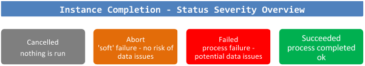

<link rel="stylesheet" href="style.css" type="text/css">

# DIRECT Detailed Specification

## Introduction

### Intent

This Design Pattern describes the design decisions and considerations that support the implementation of the Operational MetaData (OMD) framework. The pattern is related to the A150 - Metadata Model top-level document and its purpose is to define the related processes in more detail.

### Positioning

Similar to exception and error handling concepts the Metadata Model links in with every process, layer or area in the architecture. Each individual layer definition document will describe how the metadata model is used for that particular section of the architecture.

The Metadata Model document itself will list and explain the available concepts and will provide an overview of the complete framework.


In general, the metadata process model supports the ability to trace back what data has been loaded, when and in what way for every interface. A single attribute in any place in the architecture should be auditable back to the originating source system.

This means that the following information must be available (at date/time level):

* When a record was inserted
* When a record was updated
* What the source system was where the record originated from
* When the event took place that changed the source data
* Which interface has loaded the data (the Module)
* Which workflow has loaded the data (the Batch)
* On which platform the ETL took place (also true for source data)
* When data was most recently offered to the model (integration layer specific)

For tables that store history the metadata includes the regular start and end date/time information as well as flags whether the record is the most actual one. The metadata model will largely be based on the Operational Metadata (OMD) Framework, but it will be updated and tailored to suit the reference architecture.

### Motivation

The OMD framework is an essential subsystem of the Enterprise Data Warehouse that supports various housekeeping processes and ultimately manages the way ETL processes are executed. The OMD model contains both process metadata as well as parameter and recovery mechanisms.

### Also Known As

* Process control
* ETL metadata

### Applicability

This pattern is applicable for all ETL processes that are run under the ETL Framework.

### Structure

OMD defines Modules as small (atomic) ETL processes and Batches as a combination or series of Modules to be run in coherence. The OMD framework defines how these concepts integrate with and impact each other. To manage these processes both the Batch and Module Instance tables maintain a set of three operational code fields which together govern the way the metadata layer executes and directs the ETL flow.

These codes or flags are:

* Execution Status Code; monitors the outcomes of the ETL process.
* Processing Indicator; provides the mechanism for internal process control.
* Next Run Indicator; provides information about how the ETL should operate on the next run, based on current information.

Both Batch Instances (signifying one single execution of an ETL workflow) and Module Instances (signifying one single execution of an ETL process) use these flags in the same manner. During the captured events, and in particular during the Module and Batch Evaluation event, the framework performs various checks to verify the data in the OMD subsystem.

These checks are:

* Check if there are no additional running Instances, save the current running Instance. A Module or Batch must complete before it can be run again
* Check if rollback / data recovery is required
* Check if the Batch is executed in compliance with its frequency settings

## Execution Status Code

Of the three code fields, the execution status summarises the (Module / Batch) Instance's processing and as such is the main operational indicator. Although there are exceptions, in most cases the status of an Instance will always be either Executing, Failed, or Succeeded. The Execution Status Code is completely driven by the OMD subsystem and should not be altered ('read only'). There is no need for any manual intervention for the Execution Status Code.

After proper testing and deployment all runs should complete successfully (Execution Status Code equals 'S'). An overview of severity is shown in the following diagram:



The detailed code purpose is defined in the following table:

| Code | Status Value | Description
| ---- | ------------ | -----------
| E | Executing | The Instance is currently running (executing). This is only visible while the ETL process is actually running. As soon as it is completed this code is updated with one of the possible values below.
| S | Succeeded | The Instance is no longer running, having completed its processing successfully. |
| F | Failed | The Instance is no longer running, but failed during its processing.
| A | Aborted | An Abort is a 'soft' failure which will not result in an error in the ETL layer but which should be investigated nonetheless as it is a result of incorrect configuration. There are two main cases that lead to an Abort event:<ol><li>The Instance in question was executed but another Instance of the same Batch or Module was already running. The same logical unit of processing can never run more than once at the same time to avoid data contentions. If this situation is detected then processing will stop (abort) the second process before any data is processed</li><li>The Module (Instance) was executed from a parent Batch (Instance) but not registered as such in the Batch/Module relationship (OMD_BATCH_MODULE).</li></ol>
| C | Cancelled / Skipped | This exception indicates that the Instance in question was executed, but that the OMD determined that it was not necessary to run the ETL process. There are three main causes for this:<ol><li>Administrator override: it is possible for the ETL environment's owners to force a scheduled run not to occur. This override enables human intervention without breaking the ETL schedule. The Instance will start, but detect the 'Cancel' override and stop without having done anything, effectively 'skipping' this ETL process in question (once). This "Cancel" override option exists both for whole Batches and for single Modules within Batches.  The 'Cancel' override itself is set through the Next Run Indicator. Use with caution.</li><li>The "Inactive Indicator' is set on individual Module / Batch Level or the Module/Batch relationship. For instance, a Module can be disabled (Inactive Indicator set to 'Y') in general, or for a specific Batch. When the Instance is started it will be Cancelled/Skipped.</li><li>The Instance has already run. This can happen if:<ol type="a"><li>Modules that were run successfully in an otherwise failed Batch Instance are rerun when the failed Batch is restarted. There are situations where the parent Batch has previously failed, but within that failed Batch Instance the Module completed its instance successfully. In that case, it is not necessary to re-run the Module again when the Batch is restarted. The OMD will automatically detect this and 'skip' all successfully completed Modules in the second iteration of the Batch.</li><li>Batches are rerun within their frequency interval setting.</li></ol></li></ol>

---

### Processing Indicator

Whereas the Execution Status Code reports on the Instance, the Processing Indicator directs the actions of the Instance. Because there are a number of modular components across different technologies (for instance Oracle uses stored procedures to control its processing, while software such as Informatica Powercenter can execute mappings and workflows), this indicator is used to share processing directions between them.

The Processing Indicator is the outcome of the Module (or Batch) Evaluation Event as defined in the high level document 'A150 - Metadata Model'. This is an evaluation process that runs before the execution of Instances and the Processing Indicator is the information that OMD provides based on the evaluation steps. Similar to the Execution Status Code this is a 'read only' attribute that does not require manual intervention at any point in time.

| Code | Process Value | Description
| ---- | ------------- | -----------
| P | Proceed | The Instance can continue on to the next step of the processing. This is the default processing indicator value; each process step will evaluate the Process Indicator and continue only if it was set to "P". After the pre-processing has been completed the "P" value is the flag that is required to initiate the main ETL process.
| A | Abort | This exception case indicates that the Instance in question was executed, but that another Instance of the same Batch or Module was already running (see also the equivalent execution status code for more detail). This is one of the sanity checks performed before the regular ETL (Module and Batch) can continue. If this situation occurs, all processing should stop; no data should be processed. The process will use the Processing Indicator "A" to trigger the Module/Batch "Abort" event which sets the Execution Status Code to "A", ending the process gracefully.
| C | Cancel / skip | That the evaluation process has determined that it is not necessary to run this ETL process (see also the equivalent execution status code for more detail). As with the Abort, if the process indicator is Cancel then all further processing should stop after the Execution Status Code has been updated to "C".
| R | Rollback | The indicator for rollback is only set during rollback execution in the Module Evaluation event. This is essentially for debugging purposes. After the rollback is completed the Processing Indicator will be set to 'P' again to enable the continuation of the ETL.

---

### Next Run Indicator

As documented in the previous section the Processing Indicator directs the actions of the Instance while it is active. In contrast to this the Next Run Indicator is used to pass processing directions between instances of the same entity (Module or Batch).

The primary function of this code field is to direct the rollback functionality; if an Instance fails then the Next Run Indicator will be set to "Rollback", which means that the next time the same process is called it will first remove any (potentially) bad data inserted in the target table.

In most cases the Next Run Indicator is driven by OMD but where the Execution Status Code and Processing Indicator are 'read only' attributes the Next Run Indicator can actually be overwritten by Administrators making it a 'read/write' attribute.

| Code | Process Value | Description
| ---- | ------------- | -----------
| R | Rollback | When a current (running) Instance fails the Next Run Indicator for that Instance is updated to 'R' to signal the next run to initiate a rollback procedure. At the same time, the Execution Status Code for the current Instance will be set to 'F'.<br/><br/>Administrators can also change the Next Run Indicator value for an Instance to 'R' if they want to force a rollback when the next run commences.
| P | Proceed | The Proceed value 'P' will direct the next run of the Batch/Module to continue processing. This is the default processing indicator value; each process step will evaluate the Process Indicator and continue only if it was set to "P". After the rollback has been completed the "P" value is the flag that is required to initiate the main ETL process.
| C | Cancel / skip | Administrators can manually set this code to for the Next Run Indicator (i.e. this will not be automatically set by the OMD controls) to force a one-off skip of the Instance.

---

### OMD Batch Processing

This section details what actions the OMD framework performs upon running a Batch. A summary is provided in the following diagram:


The conceptual OMD events are documented in their context in the 'A150 - Metadata Model' document, but repeated here at a more detailed level:

1. Set the Batch Instance Start Date Time; i.e. the time when the Batch (Instance) started

1. Retrieve the Batch Information from OMD. Based on the Batch Code (the name of the parent workflow or process), the Batch ID and Frequency Code are retrieved from the OMD_BATCH table.  The Frequency Code is used for Batch Evaluation later in the process

1. Create new Batch Instance (Batch Create Instance event). This step inserts a new record in the OMD_BATCH_INSTANCE table based on the Batch ID with the:
    <ol type="a"><li>Execution Status Code as 'E' (Executing).</li>
    <li>Processing Indicator as 'A' (Abort).</li><li>Next Run Indicator as 'P' (Proceed).</li>
    <li>Start Date/Time as the Batch Instance Start Date.</li></ol>

1. These values will be changed depending on how the rest of the OMD housekeeping proceeds. The 'A' code for the Processing indicator acts as a safety net for the unlikely event that OMD fails. In other words the approach is to abort (soft error) the load until the Batch evaluation is completed correctly. The Processing Indicator will be updated as part of the Batch Evaluation event

1. Conceptually, as part of the Batch Create Instance Event, the new Instance ID is generated. The Batch Instance ID must be retrieved for further processing. The query to identify the Instance ID is as follows:

    ```sql
    SELECT BATCH_INSTANCE_ID, PROCESSING_INDICATOR
    FROM OMD_BATCH_INSTANCE
    WHERE EXECUTION_STATUS_CODE='E'
    AND BATCH_ID= <the Batch ID>
    ```

1. Evaluate the current Batch Instance (Batch Evaluation event). Similar to the Module Evaluation this event performs sanity checks and housekeeping for the OMD framework on Batch level. If the evaluation finishes successfully and no issues have been encountered the Processing Indicator will be set to 'P' (proceed) and the Modules can be started (instantiated). The Batch Evaluation verifies a number of scenarios and sets the Processing Indicator accordingly

An overview of the Batch Evaluation steps is displayed in the following diagram:


The process is as follows:

1. Check for multiple running instances; Batches are not allowed to run in parallel; the next Batch can only start if the previous one has been completed. If there are more running instances for the same Batch the current / new Instance is 'aborted'.

1. If the current Instance is the only running Instance the process continues. This information is queried as follows:

    ```sql
    SELECT COUNT(*) as ActiveInstancesCount
    FROM OMD_BATCH_INSTANCE
    WHERE EXECUTION_STATUS_CODE = 'E'
      AND BATCH_ID = ?
      AND BATCH_INSTANCE_ID < ?
    ```

1. Verify the Inactive Indicator. Only the Batch level indicator requires to be checked. If the Inactive Indicator is set to 'Y' the running Instance will be skipped.

1. Retrieve previous Instance details. The Next Run Indicator and the Execution Status Code set by the previous Instance sets the behaviour for the running one. The following scenarios are possible:

    <ol type="a"><li>If the previous (Batch) Next Run Indicator indicates 'C' (Cancel / Skip) this means that the Batch was manually set to inactive for the single run and the Processing Indicator for the current Instance will be set to 'C'. This will be further handled by the Batch Skip Event which will close the Instance and set the Execution Status Code to 'C' as well during this process.</li>
    <li>If the previous (Batch) Execution Status Code is 'F' this means the previous Batch has failed and the rollback process is initiated.</li></ol>

1. Rollback. The default rollback mechanism skips Modules that have successfully completed in a Batch Instance that ultimately failed. This way, no ETL is reprocessed without there being a reason for it. However, the administrator can set the Next Run Indicator manually to 'R' to force a full rollback for all Modules associated with the Batch.

    <ol type="a"><li>If the previous (Batch) Next Run Indicator indicates 'R' the rollback process is performed on all Modules (regardless of the Module's Next Run Indicator). Rollback is then executed further on the Module level through the Module Evaluation. This is implemented by overriding the individual Module Instances for recovery (Next Run Indicator  = 'R' on Module level).</li>
    <li>If the previous (Batch) Next Run Indicator indicates 'P' the Modules that were completed successfully are set to be skipped the next time the Batch runs. This is implemented by overriding the Next Run Indicator on Module level to 'C' which is further handled by the Module Evaluation.</li></ol>

1. After the rollback process, or in the case there were no previous failures, the Evaluation is completed and the Processing Indicator is set to 'P'. This is the safety catch for the Modules to start. The Modules are individually executed in the order as directed by the Batch

    <ol type="a"><li>If at this point the Processing Indicator is 'C' (as determined during Batch Evaluation, the Batch will be skipped (Batch Skip/Cancel event).  Similar to the above, in this scenario multiple runs have been detected and one of the running workflows (the current one) is aborted but there is no reason not to restart normally next time, so the Next Run Indicator is set to 'P'.</li>
    <li>Similarly, if the Processing Indicator is 'A' the Batch will be aborted (Batch Abort event).</li>
    <li>As mentioned, if the Processing Indicator is 'P' the subsequent sessions (Modules) will start. No Modules are allowed to start unless this indicator equals 'P'.</li></ol>

1. Post-processing. The following scenarios are possible:

    <ol type="a"><li>After all Modules have been completed without any issues the Batch Success event will update the Batch Instance to set the (Batch) Execution Status Code to 'S' (success), the (Batch) Next Run Indicator as 'P' and the current date/time as the End Date/Time.  This indicates that the Batch has been completed successfully and can be run normally next time. For Modules 'no issues' in this context means that Modules have received anything but the Execution Status 'F'.</li>
    <li>If a failure is detected at any time during this process the Batch Failure event is initiated. This event sets the (Batch) Execution Status Code to 'F' which is used to drive rollbacks on Module level the next time the Batch is initiated. Any meaningful information will be logged to the OMD_EVENT_LOG table.</li></ol>

### OMD Module Processing

This section details what actions the OMD framework performs upon running a Module. A summary of this process step is displayed in the following diagram:


The conceptual OMD events are documented in their context in the 'A150 - Metadata Model' document and detailed here:

1. Set the Module Instance Start Date Time; i.e. the time when the Module (Instance) started.

1. Retrieve the Module Information. Based on the name of the ETL process as defined in the ETL platform, the Module Code, the Module ID is retrieved from the OMD_MODULE table. This means the process name is hard-coded for each individual ETL process and must be properly registered in OMD; pre-populated in the OMD_MODULE table. Other relevant information from OMD_MODULE such as the Area Code and Table Name is also retrieved at this stage for later use in the rollback process

1. Create a new Module Instance (Module Create Instance event). With the available information a new Module Instance can now be created with the:
    1. Execution Status Code as 'E' (Executing).
    1. Processing Indicator as 'A' (Abort).
    1. Next Run Indicator as 'P' (Proceed).
    1. The Start Date Time will be set as the Module Instance Start Date Time as set in step 1

1. This is an insert into the OMD_MODULE_INSTANCE table. The 'A' code for the Processing indicator acts as a safety net for the unlikely event that OMD fails while pre-processing. In other words the approach is to abort (soft error) the load until the Module evaluation is completed correctly. The Processing Indicator will be updated as part of the Module Evaluation event.

1. It must be possible to run Modules (mappings) individually (i.e. without a parent Batch):

    1. If the Module was initiated from a Batch process, the Batch Instance ID is inherited from the parent Batch Instance.

    1. If the Module is run without a Batch, for instance while troubleshooting or testing the Batch Instance ID will be 0 (zero).  This is typically a situation encountered in a development setting.

1. The action to retrieve the Module Instance ID as created by the previous step is conceptually part of the Create Instance Event but the technical implementation depends on the ETL and/or database capabilities (i.e. using sequence generators).

1. The query to identify the Instance ID is as follows:

    ```sql
    SELECT MODULE_INSTANCE_ID
    FROM OMD_MODULE_INSTANCE
    WHERE EXECUTION_STATUS_CODE='E'
      AND MODULE_ID= <the retrieve Module ID>
      AND START_DATETIME = <the initial Module Instance Start Date Time>
      AND BATCH_INSTANCE_ID= <the inherited Batch Instance ID or 0 (zero)>
    ```

1. The Module ID, (Module) Execution Status Code and Batch Instance ID are required since Modules can be potentially be executed in parallel from different Batches and it is required that OMD is able to select the correct running Instance. In this scenario the Module Evaluation event will 'Abort' all Instances after the first of the parallel Instances based on the Module Instance ID value (which is a sequenced attribute).

1. In other words; the earliest instance will be allowed to continue to run, but all others will abort.

1. Evaluate the current Module Instance (Module Evaluation event). This event performs the sanity checks and housekeeping for the OMD framework on Module level. It is the most complex part of the pre-processing.

The following diagram highlights the evaluation actions:


The process is as follows:

1. Check for multiple running instances; if there are more running instances for the same Module only the first one is allowed to continue, the other active Instances must be aborted. This means that the current in-progress Module Instance for which the check is done needs to query if it itself is in the earliest (MIN) of the set of active Instances for the same Module. If this is true the Instance can continue, otherwise it will be flagged to be aborted (Processing Indicator 'A')

1. This value in of the Processing Indicator will trigger an update of the OMD_MODULE_INSTANCE table to set the Execution Status Code to 'A' for the current Instance and avoid executing of the regular ETL logic

1. Validate Batch Execution. OMD will query the Batch information to validate if the Module was registered properly (i.e. contains an entry in the Batch/Module relationship table) when instantiated from a Batch. This check also takes into account the value of the Inactive Indicator on Batch/Module level

1. If this value is set to 'Y' the current Instance will be skipped as this indicates the Module is disabled for the particular Batch

1. Retrieve Previous Instance details. If allowed to continue the Module Evaluation then checks if the previous run(s) have failed or not. It will select the Next Run Indicator value from the previous Module Instance to direct the internal OMD processing. If a failure is detected (the status of the previous instance Next Run Indicator is 'R') this step will create an array of all Module Instances from the last logged successful run to the most recent (failed) run

1. This effectively selects multiple failed runs for rollback from the point where the run was last successful. This array of (failed) Module Instances will ultimately be used as the 'IN' clause of the Rollback SQL

1. Based on the result of this check the following scenarios are possible:

    <ol type="a"><li>If the previous (Module) Next Run Indicator is 'C' (skip / cancel) the run will be finished before the actual ETL starts. This can happen if:
        <ol type="i"><li>The system administrator has labelled this Module to be disabled for this run by manually setting the Next Run Indicator value to 'C' in the Module Instance.</li>
        <li>The previous Batch failed but the specific Module (Instance) was run successfully in that particular Batch and is skipped when the Batch is run again (rollback on Batch level).</li></ol>

    <li>If the previous Module Next Run Indicator is 'R' (rollback) the rollback process is started (see Rollback section). The Rollback process uses the Area Code and Table Name to create dynamic SQL statements. After the rollback SQL has been executed correctly the Processing Indicator is set to 'P' and processing will continue as usual.</li></ol>

1. The Module Evaluation effectively returns the Processing Indicator for the current Module Instance. The next step for the OMD processing is to interpret this indicator for the current Module Instance to either stop or continue the processing

1. After the Module Evaluation is complete and the Processing Indicator equal 'P' the regular ETL process can be executed. In other words, no regular processing is allowed unless this indicator is 'P'.  This is the safety catch for the Module to start.

    <ol type="a"><li>If at this point the (Module) Processing Indicator is 'C' the Module Instance record is updated to set the final Execution Status Code to 'C' and the End Date/Time to the current date/time value (sysdate, getdate or equivalent).</li>
    <li>If at this point the (Module) Processing Indicator is 'A' the Module Instance record is updated to set the final Execution Status Code to 'A' and the End Date/Time to the current date/time value (sysdate, getdate or equivalent).</li>
    <li>As mentioned, if the Processing Indicator is 'P' the real ETL logic will be executed. No Modules are allowed to start unless this indicator equals 'P'.</li></ol>

1. Post-processing. After the ETL logic has completed without any issues, the Processing Indicator of the Module Instance is checked.

1. The following scenarios are possible:

    <ol type="a"><li>If the (Module) Processing Indicator is 'C' the Module Instance is updated with the Execution Status Code set to 'C', the Next Run Indicator as 'P' and the current date/time as the End Date/Time. This is the Module Skip event.</li>
    <li>If the Processing Indicator is 'A' the Module Instance is updated with the Execution Status Code set to 'A', the Next Run Indicator as 'P' and the current date/time as the End Date/Time. This is the Module Abort event.</li>
    <li>If the Processing Indicator is 'P' and the ETL runs without issues the Module Instance is updated to set the Execution Status Code to 'S' (success), the Next Run Indicator as 'P' and the current date/time as the End Date/Time. As a separate step the record counts are updated in the OMD_MODULE_INSTANCE table.</li>
    <li>If a failure is detected at any time during the OMD process (i.e. either Module start or end process), the Module Failure event is initiated. This event sets the Execution Status Code to 'F' and the Next Run Indicator to 'R' for the current Instance.  Any meaningful information will be logged to the OMD_EVENT_LOG table.</li></ol>

The following table highlights these scenarios:
 OMD_indicators

### Rollback Procedures

The rollback procedures are essentially SQL queries that are dynamically created by OMD. The exact syntax can vary between deployments and depending on naming conventions, modelling techniques and used ETL templates. For this purpose, the rollback is a configurable component. In all cases, the rollback procedure depends on consistency of the Batch definition (i.e. all Modules in a Batch Instance must be completed). The following inputs are required:

* The Table Type is derived from the Table Code as queried from the OMD_MODULE table.

* The Instance Array is provided by the Module Evaluation event based on the information of previous (failed) Instances

<table>
<tr><th>Area</th><th>Table Type</th><th>Rollback Procedure</th></tr>
<tr><td>STG</td><td>All</td><td>Truncate the table. This is essentially redundant as all Staging Area tables are truncated before their run but adding this rollback type completes the picture. Similarly, a rollback against the OMD Source Control table is also performed, regardless of the interface requires management of load windows.

```sql
TRUNCATE TABLE <OMD Table Code>

DELETE FROM OMD_SOURCE_CONTROL WHERE MODULE_INSTANCE_ID IN (<Instance array>)
```

It must be noted that a STG rollback should also trigger a rollback of the HSTG information to support some interfaces (full outer join or other delta detection driven by HSTG).</td></tr>
<tr><td>HSTG</td><td>All</td><td>Since the HSTG is an insert-only table, only a delete statement is sufficient.

```sql
DELETE FROM <OMD Table Code> WHERE OMD_INSERT_MODULE_INSTANCE_ID IN (<Instance array>)
```

</td></tr>
<tr><td>INT</td><td>HUB</td><td>Hub type tables are insert-only tables so only a delete statement is sufficient.

```sql
DELETE FROM <OMD Table Code>
WHERE OMD_INSERT_MODULE_INSTANCE_ID IN (<Instance array>)
```

</td></tr>
<tr><td></td><td>3NF</td><td>Depends on the specific scenario; a separate process may be required</td></tr>
<tr><td>INT</td><td>SAT / LINK</td><td>Satellite and Link-Satellite tables are tables that contain historical information and by default use end-dating (expiry date) to close off old records. In this case a combination of inserts and updates is required for rollback.

```sql
DELETE FROM <OMD Table Code>
WHERE OMD_INSERT_MODULE_INSTANCE_ID IN (<Instance array>)

UPDATE <OMD Table Code>
SET OMD_EXPIRY_DATE='9999-12-31', OMD_CURRENT_RECORD_INDICATOR='Y'
WHERE OMD_INSERT_MODULE_INSTANCE_ID IN (<Instance array>)
```

</td></tr>
<tr><td>INT</td><td>LINK</td><td>Similar to the Hub the Link type tables are insert-only and the same logic applies.

```sql
DELETE FROM <OMD Table Code>
WHERE OMD_INSERT_MODULE_INSTANCE_ID IN (<Instance array>)

```

</td></tr>
<tr><td>PRES</td><td>All</td><td>Dependent on specific requirements</td></tr>
<tr><td>HELPER</td><td>All</td><td>Dependent on specific requirements</td></tr>
</table>

---

## Implementation Guidelines

* The implementation of OMD is to some extent dependent on the used ETL platform

* The query to retrieve the previous Module Instance information, including the array of failed Instances (if any) can be implemented following this logic (SQL Server):

```sql

SELECT
 ISNULL (Max(LastBatchInstanceID),-1)                AS 'LastBatchInstanceID'
,ISNULL (Max(LastModuleInstanceID),-1)                AS 'LastModuleInstanceID'
,ISNULL (Max(LastStartDateTime),'1900-01-01')        AS 'LastStartTime'
,MAX(LastEndDateTime)                        AS 'LastEndTime'
,ISNULL (Max(LastExecutionStatus),'I')                AS 'LastExecutionStatus'
,ISNULL (Max(LastNextRunIndicator),'P')                AS 'LastNextExecutionFlag'
,ISNULL(Max(LastModuleInstanceIDList),'-1')         AS 'LastModuleInstanceIDList'
FROM
(
        (SELECT
            A.BATCH_INSTANCE_ID                AS 'LastBatchInstanceID',
            A.MODULE_INSTANCE_ID        AS 'LastModuleInstanceID',
            A.START_DATETIME                AS 'LastStartDateTime',
            A.END_DATETIME                AS 'LastEndDateTime',
            A.EXECUTION_STATUS_CODE         AS 'LastExecutionStatus',
            A.NEXT_RUN_INDICATOR        AS 'LastNextRunIndicator',
            (SELECT Cast('(' + STUFF
                (
                 (
                   Select ',' + CAST(MODULE_INSTANCE_ID AS VARCHAR(20))
                   From        OMD_MODULE_INSTANCE
                   Where MODULE_ID = ?
                     AND MODULE_INSTANCE_ID >
                         (
                            -- Find the most recent successful run, 0 is zero
                            SELECT ISNULL(MAX(MODULE_INSTANCE_ID),0)
                            FROM OMD_MODULE_INSTANCE
                            WHERE MODULE_ID=?
                              AND EXECUTION_STATUS_CODE='S'
                              AND NEXT_RUN_INDICATOR = 'P'
                          )
                         AND EXECUTION_STATUS_CODE<>'E'
                           FOR XML PATH ('')  -- convert list module id to single variable
                           ),1,1,''
                  ) + ')' as VARCHAR(500))) AS 'LastModuleInstanceIDList'
         FROM OMD_MODULE_INSTANCE A
         INNER JOIN OMD_MODULE B ON A.MODULE_ID = B.MODULE_ID
         INNER JOIN OMD_BATCH  C ON B.BATCH_ID =  C.BATCH_ID
         WHERE A.MODULE_INSTANCE_ID =
                (
                        (select max(MODULE_INSTANCE_ID)
                         from OMD_MODULE_INSTANCE
                         where MODULE_ID = ? AND EXECUTION_STATUS_CODE <> 'E')
            )
         )
        UNION ALL -- return if there is nothing, to give at least a result for SSIS
        SELECT NULL, NULL, NULL, NULL, NULL, NULL, NULL
) as sub1

```

* Updating the Module or Batch Instance records can be implemented following the logic defined in the following SQL statement:

```sql

UPDATE OMD_<Module or Batch>_INSTANCE
SET EXECUTION_STATUS_CODE='C' (or 'S', 'A', 'F'), NEXT_RUN_INDICATOR = 'P', END_DATETIME=<System Date/Timestamp> WHERE (Module or Batch>_INSTANCE_ID=?

```

* An insert into the Event Log table can be done using the logic as defined in the following SQL statement:

```sql

INSERT INTO OMD_EVENT_LOG (BATCH_INSTANCE_ID,MODULE_INSTANCE_ID,EVENT_DATETIME,EVENT_TYPE_CODE,EVENT_RETURN_CODE_DETAILS,EVENT_DETAIL,ERROR_BITMAP)
VALUES (?,0,<System Date/Timestamp>,2,?,?,0)

```

* Creating a new Module or Batch Instance record can be implemented following the logic defined in the following SQL Statement:

```sql

INSERT INTO OMD_<Module or Batch>_INSTANCE (
<Module or Batch>_ID, START_DATETIME, EXECUTION_STATUS_CODE, NEXT_RUN_INDICATOR, PROCESSING_INDICATOR, <Module or Batch>_EXECUTION_SYSTEM_ID) VALUES(?,?,'E','E','E',?)

```

* The check for multiple running Instances can be implemented following the logic as defined in the following query:

```sql

SELECT
        CASE
                WHEN ActiveInstancesCount IS NULL THEN 'Process'
                WHEN ActiveInstancesCount IS NOT NULL AND MinimumInstance= ? THEN 'Process'
                ELSE 'Abort'
        END AS ModuleActiveInstanceControl
FROM
(
   SELECT MODULE_ID, MIN(MODULE_INSTANCE_ID) as MinimumInstance
   FROM OMD_MODULE_INSTANCE
   WHERE EXECUTION_STATUS_CODE = 'E' AND MODULE_ID = ?
   GROUP BY MODULE_ID
  -- Check for the lowest instance of the Module Instances since the process must continue if it's the first of the started instances for the particular Module.
) MinimumInstance
LEFT OUTER JOIN
(
   SELECT MODULE_ID, COUNT(*) as ActiveInstancesCount
   FROM OMD_MODULE_INSTANCE
   WHERE EXECUTION_STATUS_CODE = 'E' AND MODULE_ID = ?  AND MODULE_INSTANCE_ID <> ?
   GROUP BY MODULE_ID
   -- Check if there are no additional running instances other than the current Module Instance
)  ActiveInstances ON ActiveInstances.MODULE_ID=MinimumInstance.MODULE_ID

```

* The query to retrieve the last Instance information for the current Batch can be based on the following logic:

```sql

SELECT ISNULL(MAX(A.NEXT_RUN_INDICATOR),'P') AS NEXT_RUN_INDICATOR,
ISNULL(MAX(A.EXECUTION_STATUS_CODE), 'S') AS  EXECUTION_STATUS_CODE
FROM
(
SELECT NEXT_RUN_INDICATOR,
EXECUTION_STATUS_CODE
FROM OMD_BATCH_INSTANCE
WHERE BATCH_ID =  ?
AND END_DATETIME = (SELECT MAX(END_DATETIME) FROM OMD_BATCH_INSTANCE WHERE BATCH_ID = ?) )A

```

### Consequences

An individual Module or Batch cannot be run before the running Instance has finished.

### Known Uses

These designs are part of the ETL wrappers for all ETL processes that are executed in the ETL Framework.

### Glossary
