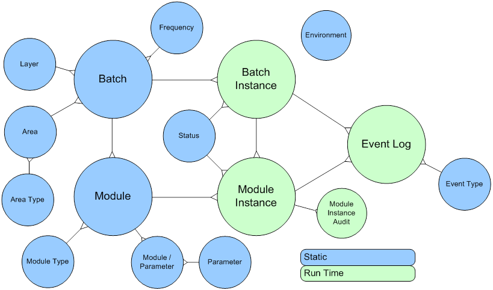

# Introduction
DIRECT is a data integration control and execution metadata model. It is a core and stand-alone component of the Data Integration Framework. Every Extract Transform and Load (ETL) process is linked to this model which provides the orchestration and management capabilities for data integration. ETL in this context is a broad definition covering various related data integration approachess such as ELT (Extract Load, Transform - pushdown into SQL or underlying processing) and LETS (Load-Extract-Transform-Store). ETL in this document essentially covers all processes that 'touch' data.

The repository essentially captures process information about the ETL and is an invaluable source of information to monitor how the system is expanding (time, size) but also to drive and monitor ETL processes.

This document references all other architectural documents because the metadata model is an integral part of a fully implemented system. For functionality such as rollback and recovery information about the individual ETL processes including the related layers and areas as defined in the Outline Architecture are retrieved from the repository.

The objective of the DIRECT Framework is to provide a structured approach to describing and recording ETL processes that can be made up of many separate components. This is to be done in such a way that they can be represented and managed as a coherent system.
 
# Overview
This metadata model document covers the design and specifications for the metadata repository and the integration (events) for data integration processes. The documentation also includes the available (logical) scripted components for controlled execution of ETL within the Enterprise Data Warehouse. The DIRECT framework covers a broad variety of process information, including (but not limited to):
* What process information will be stored and how
* How this is effectuated into the various defined Layers and Areas
* Of what entities the metadata model consists
* The available procedures for managing the Data Warehouse environment
* Concepts and principles
* The logic which can be used to control the processes
* Housekeeping functions

## Positioning of DIRECT
The position of the control and execution framework in the overall architecture is:
 

 
# Concepts
## Elements of process information
While the physical components involved in the end-to-end ETL process can vary in scope and can employ a range of technologies, the framework provides a logical layer of abstraction so that a consistent view of the workflow can be visualised, maintained and reported.

At the core of the framework is a logical model for describing units of work. All ETL processes executing within the Data Warehouse environment conform to this basic two-level hierarchy.
* Batch – contains a group of executable elements. This group typically applies to a single Layer and single Area but not necessarily so.  A Batch can be defined to fit any purpose by organising any available Module.
* Module – the smallest executable unit. By definition of the structuring of ETL processes, a Module may only apply to a single Area of the Outline Architecture.
In order to simplify the association of logical units of work and their physical counterparts the physical component model also conforms to a simple two level hierarchy.
* A Batch equates to an ETL workflow object and only an ETL workflow object. 
* A Module can be an ETL process (Mapping, Package), an Operating System shell script or a SQL script (procedure call).

The following diagram illustrates the logical and physical models for units of work:
 

## Orchestration
The sequencing and submission of modular work units is controlled by two different technologies. Batches are controlled by the enterprise scheduling tool according to the execution plan defined within that environment. The modules within a Batch are sequenced by the ETL engine.

In this way it is not possible for a Batch to initiate a Module other than those defined within it nor is it possible for a Module to invoke a Module other than those within its own Batch. Batches are initiated only by the completion of another Batch and only at the direction of the scheduling software.

Modules are initiated only through the completion of another Module within the same Batch and are not scheduled directly in the scheduling tool. 

The following figure illustrates the end-to-end orchestration structure for Batches and their Modules:

## Instantiation
The repository is required to record the execution status and history of the defined ETL processes as and when they are invoked. Dedicated data entities are provided for the recording of work unit executions or instances:
*	Each execution of a Batch results in a Batch Instance.
*	Each execution of a Module results in a Module Instance.

Each instance created is assigned a unique identifier used to tag its output and so allow the system and its users to identify the effects of a discrete component execution. If a Batch or Module is run more than once (due to restarting or re-running) a new instance record is created in order to provide full execution history.

The following figure describes how a static Batch/Module definition creates run-time instances of itself.
 

## Parameters
The framework provides for the definition of parameters and their association with defined Modules. The framework allows the ETL processes to use these parameters at run-time (depending on the ETL software used). Any parameter defined as global is used by all Modules.

## Logical model
The concepts and principles described so far in this document form the basis of the DIRECT data model. The  data entities required to describe the core concepts are described by the following Entity Relationship model:
 

## Execution layers
There is a range of technologies and tools involved in the invocation and tracking of modular work units. Logical control is passed between the layers as follows:
1. The scheduling tool invokes the next job (Batch) in its plan/schedule. This may involve executing a common wrapper script or series of events.
1. The repository is consulted for the execution syntax of the nominated Batch and creates a new Batch Instance if required.
1. The newly created Batch Instance is executed and the system awaits a response.
1. The Modules defined within the Batch are called in turn with each creating and updating its own Module Instance.
1. After the Module Instances have been run the control is returned to the repository and the Batch Instance will be updated to reflect completion or failure.
1. The scheduling job is complete and free to invoke the next job in the plan.

The following diagram illustrates the layers and technologies involved in this process:
 

## Rollback and re-processing
When processing errors occur, relevant information is recorded in the repository by the framework. This information is used to properly recover from ETL loading errors and set the Data Warehouse back into the original state prior to the occurrence of the error. This can be configured to work at both Batch and Module level. 

By default a Batch will roll back the data from all Modules that have been run as part of the specific Batch. A Module is always configured to recover if errors are detected in previous runs. This information is presented to the events as arrays of the relevant Batch and Module Instance Identifiers. The type of recovery depends on the type of data model but typically leads to DELETE and UPDATE statements on one or more tables. This is in line with the overall ETL requirements as defined in Design Pattern 003 – Generic – ETL requirements. This specifies that ETL should be able to be rerun and recovery failed attempts.

The following is a high level overview of the reprocessing strategy. These actions are implemented as part of the Batch and Module Evaluation events (described in the next section):
* **Staging Area** ; the target table is truncated. This essentially is a redundant step because the Staging Area is truncated by the Module Instance but the step is added for consistency reasons and to be on the safe side for reprocessing
*	**Staging Area** ; if the Source Control table is implemented this information is corrected by deleting the entries that were inserted by the failed Module Instances
*	**Persistent Staging Area** ; all records that have been inserted by the failed Module Instances are deleted. Due to the default (mandatory) structure of the History Area tables only the delete statement is sufficient
*	**Integration Layer** ; rollback varies depending on the type of model but rollback usually is a combination of inserts and deletes depending on the types of tables in the Data Warehouse (in turn dependant on the data modelling technique). An example of recovery using Data Vault is added below:
    * Hub table: deletion of all records inserted by the Module Instance. 
    *	Link table: deletion of all records inserted by the Module Instance.
    *	Satellite table: deletion of all records inserted based on the Insert Module Instance ID attribute. Also included is an update of all records to set these to be the active record again (repair timelines) using the Update Module Instance ID information

The Interpretation Area, Helper Area and Reporting Structure Area typically use a strategy similar to the ones used on the previous steps but can be custom defined to suit the (reporting) purpose. Custom rollback approaches are documented in Implementation Patterns for the corresponding purpose.
 
# Physical design
The physical implementation of the framework requires the development of components in three distinct areas:
1. The repository database.
1. The events; the scripts and functions representing the framework logic.
1. Housekeeping and support elements.

## Repository database
The complete data model for the Operational Metadata Framework is managed using Embarcadero ER/Studio. This data model contains all involved entities, attributes and their descriptions.  Specific DDL for a variety of database can be generated from this model along with constraints and table comments for the descriptions. The model also contains content for the various tables including (reference) values for the Layers, Areas and code tables such as Frequency and Severity.
 
Table | Description
----- | -----
AREA	| The Area table contains the list of Areas as defined in the ETL Framework Outline Architecture. This information is queried by the framework during Module execution to prepare rollback information if required. The Area is the most detailed classification of ETL processes in the ETL Framework. By defining the Area and specific settings on Module level (through naming conventions) the rollback queries can be created dynamically.
BATCH	| The Batch table contains the unique list of Batches as registered in the framework. To be able to run successfully each Batch must be present in this table with its own unique Batch ID. Batch IDs are generated keys. 
BATCH_INSTANCE	| At runtime, the framework generates a new Batch Instance ID for the Batch execution. This information is stored in this table along with ETL process statistics. The Batch Instance table is the driving table for process control and recovery as it contain information about the status and results of the Batch run.
BATCH_MODULE |	The Batch Module table contains the relationships between batches and modules. It is a many-to-many relationship, i.e. one Batch can contain multiple Modules, and one Module could be utilised by multiple Batches
DATA_AUDIT	| The Data Audit table provides a location for custom functionality to perform sanity checks and/or housekeeping on specific data store. These processes should be run separately from the main ETL processes and can be configured to perform a range of supporting functionality such as clean-ups and reconciliation.
DATA_AUDIT_TYPE |	The Data Audit Type table was added to allow for a classification of Data Store Audits, and to provide additional handling and descriptive information about these housekeeping processes
DATA_STORE	| The Data Store table contains descriptive information of data stores that are read from or loaded by the ETL process. The ‘Allow Truncate Indicator’ attribute can be used in custom Stored Procedures to prevent accidental truncation of tables (safety catch).
DATA_STORE_TYPE	| The Data Store Type table contains optional descriptive information: the type of data stores, such as flat file or table.
ERROR_BITMAP	| The Error Bitmap table contains the master list of possible errors. One or more errors from this list may be detected and logged as an Error Bitmap in the target tables. A bitwise join will enable this bitmap to relate back to the various errors as defined in this table.
ERROR_TYPE	| The Error Type table contains descriptive information about types of events or errors for reporting purposes. By default all errors are associated with the Error Bitmap but additional errors and error types can be added.
EVENT_LOG	| The Event Log table is a generic logging table which is used to track and record events that happen during ETL execution. The Event Log table can contain informative details (i.e. ‘Batch Instance was created’) or information related to issues or errors provided by the ETL platform. 
EVENT_TYPE	| The Event Type table contains descriptive information about types of events or errors for reporting purposes, such as process logs, environment related issues, and custom defined errors or ETL process errors.
EXECUTION_STATUS	| The Execution Status table contains descriptive attributes about the Execution Status codes that OMD uses during the ETL process. 
FREQUENCY	| The Frequency table contains descriptive information about the frequency codes of a Batch run.
LAYER	| The Layer table contains the list of Layers as defined in the ETL Framework Outline Architecture. Unlike the Areas this information is not queried during Module execution and is purely descriptive for use in reporting. The Layer is the higher level classification of ETL processes in the ETL Framework. 
MODULE	| The Module table contains the unique list of Modules as registered in the framework. To be able to run successfully each Module must be present in this table with its own unique Module ID. Module IDs are not generated keys and are consistent across environments and represent a single ETL process.
MODULE_DATA_STORE |	The Module Data Store table contains the relationships between Modules and the Data Stores used in the Modules. For instance the target (mandatory) and source (optional) for each Module. 
MODULE_INSTANCE	| At runtime, the framework generates a new Module Instance ID for the Module execution. This information is stored in this table along with ETL process statistics. The Module Instance table is the driving table for process control and recovery as it contain information about the status and results of the Module run. The generated Module Instance ID is stored in the target tables for audit trail purposes. It also contains additional runtime details including the number of rows read (selected), updated, inserted, deleted, updated, discarded or rejected.
MODULE_PARAMETER	| The Module Parameter table creates a relationship between specific parameters and the Modules for which they are applicable. It is best practice to ‘register’ the Modules that require certain parameters in their processing using this table. 
MODULE_TYPE	| The Module Type table contains optional descriptive information for reporting purposes. As the Module is defined as the smallest executable component typically more than one type of Module is used, for instance ETL programs and Operating Scripts.
NEXT_RUN_INDICATOR | The Next Run Indicator table contains descriptive attributes about the Next Run Indicator codes that the framework uses during the ETL process.
PARAMETER	| The Parameter table provides the option to define parameters that can be queried by custom code in the ETL process. This can include (but not limited to!) flags (Initial Load Y/N) or tracking date ranges for moving loading windows into the Presentation Layer.
PROCESSING_INDICATOR | The Processing Indicator table contains descriptive attributes about the Processing Indicator codes that the framework uses during the ETL process.
RECORD_SOURCE	| The Record Source table contains abbreviations and descriptions of the source systems that interface to the Data Warehouse. Depending on the Staging Layer design decisions the Record Source Code is resolved to the ID during the Integration Layer ETL, or the ID is hard-coded in the Staging Area. Either way, the Record Source provides the option to load datasets from different systems that may contain similar information (i.e. the same keys) with different meaning. 
SEVERITY	| Severity is an optional descriptive attribute that can be used to classify the level of Errors defined in the Bitmap Error table. It can be used for reporting purposes and to select (a certain quality of) data into the Presentation Layer.
SOURCE_CONTROL |	The Source Control table is used in source-to-staging interfaces that require the administration of load windows. Examples are CDC based interfaces, pull-delta interfaces or when only a certain range from a full dataset is required but all data is provided. It is designed to track the load window for each individual Module.
VERSION |	Administrative information to record the DIRECT version used.

## Events
In order to provide a common, reusable means of interacting with the repository the framework includes a number of processes which collectively serve as the logic tier. The implementation of these events varies depending on the ETL software used in the various projects. This information is captured using Implementation Patterns, documenting how these concepts can be implemented using specific software. The following events, or functions, are defined as part of the framework:
*	Create Batch Instance; initiates a new Batch Instance for the existing Batch. This creates a new Batch Instance ID, related to the Batch
*	Batch Evaluation (‘Batch Eval’); handles sanity checks, exception handling and recovery for the Batch Instance
*	Batch Success; updates the repository to indicate successful completion of a Batch Instance process
*	Batch Failure; updates the repository to record failure and relevant information when an error occurs when processing the Batch Instance
*	Batch Abort; updates the repository when the Batch Instance processing has been aborted due to integrity issues (identified during the Batch Evaluation)
*	Batch Skip; updates the repository when the Batch Instance run has been skipped. This is an option within the framework to prevent a Batch to be run when it is set to inactive or to skipped by the previous run
*	Create Module Instance; initiates a new Module Instance for the existing Module. This creates the new Module Instance ID in OM.
*	Module Evaluation (Module Eval); performs the integrity checks for the new Module Instance and manages any reprocessing related to errors in previous related Module Instances that may be present
*	Module Success; updates the repository to record successful completion of a Module Instance
*	Module Failure; updates the repository to record failure in processing the Module Instance
*	Module Abort; aborts the Module Instance processing due to inconsistencies in the repository
*	Module Skip; this event skips the current processing of the Module Instance. This is recorded in the repository for the Module Instance, but no physical ETL processing (logic) will be executed
*	Write Event; this event or function is used to access the EVENT_LOG table for status updates
 
## Event integration
Not all Event Handling logic can be captured in generic events and ETL processes themselves also have some integration requirements in order to successfully run within the  Framework. The technical implementation can vary between ETL software but is different on Batch and Module level.

### Batch Level Integration
Ultimately, the correct calling of the events is orchestrated from the ETL process which acts as the Batch. This ETL process must perform the following tasks:
*	The Batch Instance Start Date Time is generated as soon as processing commences, even before the Batch Instance itself has been created
*	Batch information is queried to prepare calling the  Create Batch Instance event. This information (Batch ID and Frequency Code) is available in the BATCH table. 
*	The Create Batch Instance event is called, using the Batch ID. This event creates a new Batch Instance ID
*	With the Batch Instance ID being available the Batch Evaluation event is called. This event ultimately updates the PROCESSING_INDICATOR attribute for the Batch Instance (in the BATCH_INSTANCE table) and returns this indicator for use in the Batch ETL process. It also set the NEXT_RUN_INDICATOR for Module Instances belong to current Batch if a rollback was needed.
*	The Batch Instance processing interprets the Processing Indicator value and, depending on the value, calls the Batch Skip event (Processing Indicator returns a ‘C’ value for cancellation / skipping) or the Batch Abort event (Processing Indicator returns an ‘A’ value for abortion of the process). If the evaluation was done without finding any issues the Batch Evaluation will have returned a ‘P’ value for the Processing Indicator and the Module Instances of the Batch Instance can commence processing
*	After all Module Instances have been completed successfully, the Batch Success event is called
*	If, at any stage, an error is encountered in either the Batch Instance or any of the Module Instances associated with the Batch Instance the Batch Failure event is called
 
This process is displayed in the following diagram:

### Module level integration
Every Module needs to access the repository using the defined events. The integration on Module level ensures that every single ETL process is logged correctly and is able to use the available parameters. Modules that do not adopt this integration risk the integrity of the Data Warehouse. By design, if any issues arise when accessing the repository or using the events the ETL logic (ETL mapping) will not start. To allow for reprocessing the metadata is queried as well, ensuring that every Module can be run at any time without corrupting information.
The following process is followed:
*	The Module Instance Start Date Time is generated as soon as processing commences, even before the Module Instance itself has been created
*	Module information is queried to prepare calling the Create Module Instance event. This information (Module ID, Area Code and Table Code) is available in the MODULE and DATA_STORE table (linked by MODULE_DATA_STORE table) and is important for further processing; most notably the recovery mechanism.
*	The Create Module Instance event is called, using the Module ID. This event creates a new Module Instance ID
*	With the Module Instance ID being available the Module Evaluation event is called. This event ultimately updates the PROCESSING_INDICATOR attribute for the Module Instance (in the MODULE_INSTANCE table) and returns this indicator for use in the Module ETL process. During this step any required housekeeping activities such as rollbacks are executed.
*	The Module Instance processing interprets the Processing Indicator value and, depending on the value, calls the Module Skip event (Processing Indicator returns a ‘C’ value for cancellation / skipping) or the Module Abort event (Processing Indicator returns an ‘A’ value for abortion of the process). If the evaluation was done without finding any issues the Module Evaluation will have returned a ‘P’ value for the Processing Indicator and the Module Instance can commence processing
*	After the Module Instance has been completed successfully, the Module Success event is called
*	If, at any stage, an error is encountered in the Module Instance the Module Failure event is called
 
 
 
## Registration
It is essential that any new ETL object (Batch, Module, Data Store and Parameter) and the relationship have to be added to the static repository tables before execution.  This is going to be later on part of the standard procedure during development as more and more batch and modules are created.  
As these new objects are tested and then moved from one environment to another, the same details should be populated in the static repository tables except for the environment details.

### Batch registration
The Batch registration is done by adding a record in the BATCH table with the following details:
*	BATCH_ID; this is a system generated surrogate ID that is used to unique identify a Batch
*	BATCH_CODE; this is the name of the Batch (workflow name, parent package; depending on the ETL software used)
*	FREQUENCY_CODE; indicates how often the Batch can be run (for instance daily, hourly, weekly). It is usually a descriptive code only as the running interval for the ETL process is normally managed by external scheduling tool like Control-M or the build-in scheduling tool of the ETL software. When necessary, the Frequency Code can be used during the Batch Evaluation event, to evaluate the running interval and decide whether a batch should be run
*	BATCH_DESCRIPTION; the descriptive information of the Batch
*	INACTIVE_INDICATOR; indicate whether a Batch is inactive and should be skipped in the ETL process

### Module registration

The Module registration is done by adding a record in the MODULE table with the following details:
*	MODULE_ID; this is a system generated ID that is used to unique identify a Module
*	AREA_CODE; the Area as part of the Outline Architecture where the Module is part of. This identifies the type, template and purpose of the Module
*	MODULE_CODE; this is the name of the Module (mapping name, child package; depending on the ETL software used)
*	MODULE_TYPE_CODE; the type of Module (script, specific ETL job, etc.)
*	MODULE_DESCRIPTION; the descriptive information of the Module
*	INACTIVE_INDICATOR; indicate whether a Module is inactive and should be skipped in the ETL process.

### Data Store registration

The Data Store registration is done by adding a record in the DATA_STORE table with the following details:
*	DATA_STORE_ID; this is a system generated surrogate ID that is used to unique identify a Data Store
*	DATA_STORE_CODE; this is the name of the Data Store (table name, file name; depending on the type of the data store)
*	DATA_STORE_TYPE_CODE; the type of Data Store (table, flat file, etc.)
*	DATA_STORE_DESCRIPTION; the descriptive information of the Data Store
*	ALLOW_TRUNCATE_INDICATOR; Indicate whether a data store can be truncated to prevent accidental truncation of target tables

Depending on the type of a Data Store, additional information such as the file location can be stored in DATA_STORE_FILE and/or DATA_STORE_OLEDB.
 
### Parameter registration
The Parameter registration is done by adding a record in the PARAMETER table with the following details:
*	PARAMETER_ID; this is a system generated surrogate ID that is used to unique identify a Parameter. 
*	PARAMETER_KEY_CODE; this is the name of the Parameter.
*	PARAMETER_VALUE_CODE; this is the value of the Parameter
*	PARAMETER_DESCRIPTION; the descriptive information of the Parameter

### Batch – Module Relationship registration
The relationship between Batch and Module is registered by adding a record in the BATCH_MODULE table with the following details: 
* BATCH_ID; this is a foreign key from BATCH table to unique identify a Batch
*	MODULE_ID; this is a foreign key from MODULE table to unique identify a Module. 
*	INACTIVE_INDICATOR; indicate whether a Batch-Module combination is inactive and should be skipped in the ETL process.
Depending on the configuration and design of the Data Warehouse, a Batch could contain multiple Modules, and a Module can be utilised by multiple Batches. Modules and Batches can be set to inactive on both individual (Batch and Module) as well as within the relationship.

### Module – Data Store Relationship registration

The relationship between Module and Data Store is registered by adding a record in the MODULE_DATA_STORE table with the following details: 
*	MODULE_ID; this is a foreign key from MODULE table to unique identify a Module
*	DATA_STORE_ID; this is a foreign key from DATA_STORE table to unique identify a Data Store
*	RELATIONSHIP_TYPE; the type of the Data Store in the Module (source, target)

Depending on the configuration and design of the Data Warehouse, a Module can be configured to utilise one or more Data Store. Also, a Data Store can be utilised by one or more Modules. However, the current design only allows one “target” Data Store for each Module.

### Module – Parameter Relationship registration

The Module registration is done by adding a record in the MODULE_PARAMETER table with the following details:
*	MODULE_ID; this is a foreign key from MODULE table to unique identify a Module. 
*	PARAMETER_ID; this is a foreign key from PARAMETER table to unique identify a Parameter.

Depending on the configuration and design of the Data Warehouse, a Module can be configured to utilise one or more parameters.
