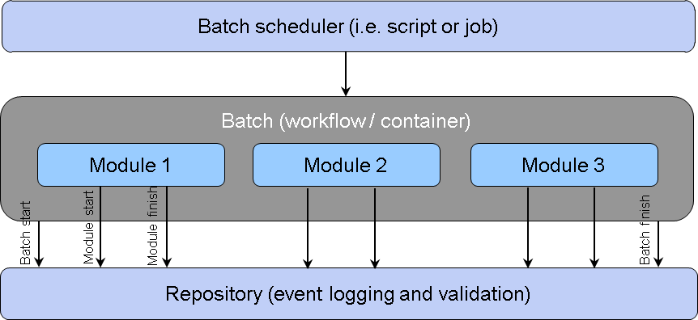
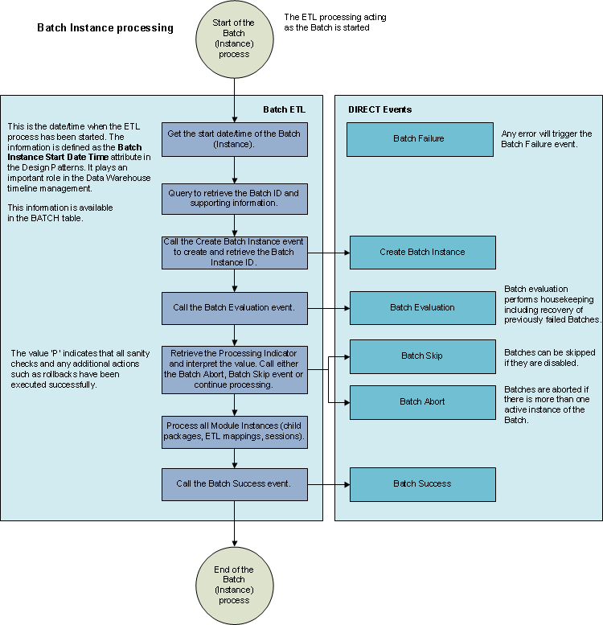
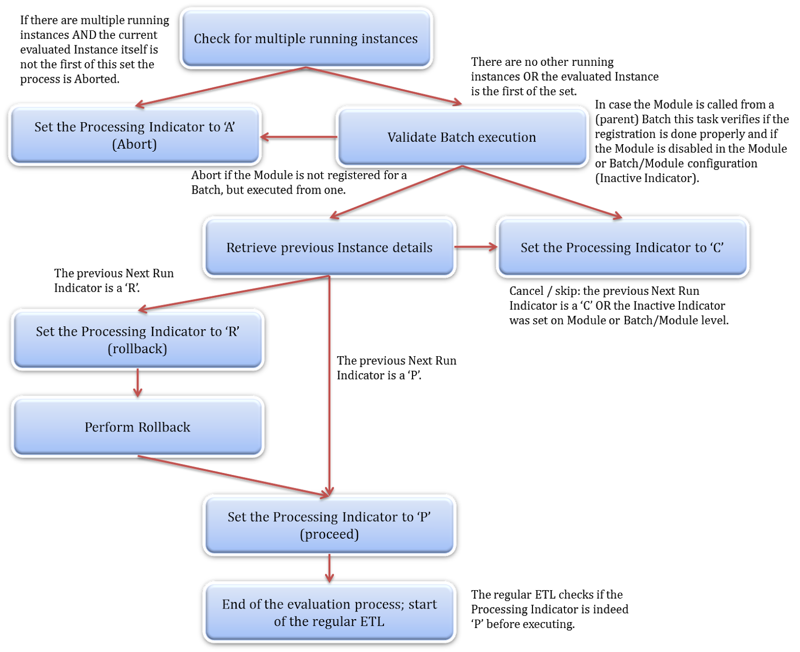
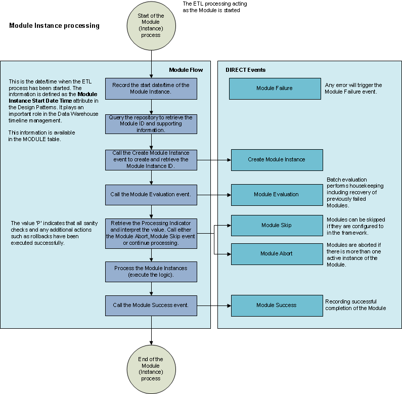

# The DIRECT Framework

## Introduction

DIRECT, the Data Integration & Execution Control Tool, is a metadata model for controlling and executing data integration processes ('processes'). A robust data logistics control framework is essential for many data solutions, and DIRECT can serve as such a framework.

Every data logistics process, such as data integration or Extract, Transform, and Load ('ETL'), can be registered in the DIRECT framework. DIRECT provides orchestration and management capabilities for data integration, ensuring smooth execution and control.

DIRECT features a database repository where each data logistics process is registered, and every runtime execution is tracked. This repository serves as a valuable source of information on platform performance, usage trends, and platform growth in terms of both time and size. At its core, DIRECT focuses on defining and orchestrating processes, while also offering advanced features like continuous and parallel processing, as well as transaction control.

The primary goal of the DIRECT framework is to provide a structured approach to describing and recording data logistics processes, which may consist of many distinct components. This structure allows these processes to be represented and managed as a cohesive system.

# Concepts

## Purpose

The framework enables tracing of processed data, detailing when and how each data logistics process was handled.

To ensure that each data element is auditable, every change record must be linked to an audit trail identifier that integrates with the DIRECT framework. In the DIRECT framework this is called the module instance id.

By connecting the module instance id in DIRECT, it becomes possible to determine:

* When a record was inserted or updated
* How many records were inserted and/or updated for a given process
* The source of the change record
* The event timestamp that triggered the data change
* The process that impacted the data
* The workflow, if any, from which the process was initiated
* The platform on which the process was executed
* The executable or code used to run the process
* Whether the process was successful, and if not, the errors encountered
* How long it takes to complete a process

## Elements of process information

While the physical components involved in data logistics processes can vary in scope and employ a range of technologies, the framework provides a logical layer of abstraction that ensures a consistent view of workflows. This allows for processes to be visualized, maintained, and reported in a uniform manner.

At the core of the framework is a logical model for describing units of work. All processes within the data platform environment conform to a two-level hierarchy:

* **Batch**: A collection of executable elements, typically applied to a single Layer and Area, though this is not always required. A Batch can be organized for any purpose by grouping available Modules.A Batch equates to a single workflow object. Batches might call other batches to create a multi-level workflow hierarchy
* **Module**: The smallest executable unit. A Module can be an executable process (e.g. Stored Procedure, Code, Mapping, Package), an Operating System shell script or a SQL script (procedure call).

The following diagram illustrates the logical and physical units of work:


## Logical model

The concepts and principles of the DIRECT framework can be summarized in this logical model:


The blue objects are static in nature, these contain the metadata required to define and orchestrate the modules and batches. For a module to run, and the audit trail to be created, a module must know its definition, and any classifications and/or parameters that might apply.

The green objects contain runtime metadata, logs of the process execution.

## Instantiation

Each time a Batch or Module is executed, a unique instance identifier is generated, known as the Batch or Module instance ID. This identifier is added to the processed data set.

The instance details are stored in the corresponding Batch/Module instance tables, where the status of each process is tracked throughout execution. This ensures full transparency regarding which processes are currently running, have been skipped, failed, or successfully completed.

* Each execution of a Batch results in a Batch Instance.
* Each execution of a Module results in a Module Instance.

If a Batch or Module is restarted or re-run, a new instance record is created to maintain a complete execution history.

The following figure illustrates how static Batch/Module definitions generate run-time instances.


Different technologies might be involved in the invocation and tracking of Modules and Batches. At a high level, the process for a Batch execution works as follows:

1. A scheduling software or manual trigger invokes the next Batch in its plan/schedule. This may involve executing a common wrapper script or series of events.
1. The repository is consulted for the execution syntax of the nominated Batch and creates a new Batch Instance if required.
1. The newly created Batch Instance is executed and the system awaits a response.
1. The Modules defined within the Batch are called in turn with each creating and updating its own Module Instance.
1. After the Module Instances have been run the control is returned to the repository and the Batch Instance will be updated to reflect completion or failure.
1. The scheduling job is complete and free to invoke the next job in the plan.

The following diagram illustrates the layers and technologies involved in this process:



## Orchestration

Conceptually, both Modules and Batches can be executed. When a Batch is executed, it triggers the execution of its associated Modules in a predefined order.

Batches can also contain other Batches, creating a multi-layered workflow where a few top-level Batches can run significant portions of the data platform.

When a Module or Batch is executed as part of a parent Batch, the instance ID of the parent Batch is inherited and stored along with the instance details of the child Module or Batch.

By convention, if a Batch contains both Modules and other Batches, the Modules are executed first, followed by the child Batches.


## Parameters

The framework supports the definition of parameters and their association with specific Modules and/or Batches. These parameters can be used by processes at run-time, depending on the underlying technology.

Parameters can also be reused across multiple Modules or Batches when necessary.

# Design

The physical implementation of the framework consists of a database repository and various procedures that interact with it to manage process execution, data logging, and error handling.

## Repository database

The data model for the process control framework includes all relevant entities, attributes, and their descriptions. It also defines the content for various tables, including reference values for Layers, Areas, and code tables such as `Frequency` and `Severity`.

The physical model is available here:


### Core tables

The following tables make up the backbone of the DIRECT framework. They reside in the `omd` schema, which stands for operational metadata.

Table | Description
----- | -----
BATCH	| Contains the unique list of Batches registered in the framework. Each Batch must have a unique Batch identifier to execute successfully. A Batch can be enabled or disabled using the `ACTIVE_INDICATOR` flag. 
BATCH_HIERARCHY | Defines the parent/child relationship between batches, when these are intended to be called from higher-level (parent) Batches. The relationship can be enabled or disabled using the `ACTIVE_INDICATOR` flag.
BATCH_INSTANCE |At runtime, the framework generates a unique Batch Instance ID for each Batch execution. This table is key for process control and recovery, as it tracks the status and results of Batch runs.
BATCH_MODULE | Defines the many-to-many relationships between Batches and Modules. A Batch can contain multiple Modules, and a Module can be used in multiple Batches. The relationship can be enabled or disabled using the `ACTIVE_INDICATOR` flag.
BATCH_PARAMETER |Establishes relationships between specific parameters and the Bathes they apply to. It is best practice to register Batches that require certain parameters in this table for proper process execution.
EVENT_LOG |	A generic logging table used to track and record events during process execution. It can store both informational entries (e.g., "Batch Instance was created") and error messages provided by the platform.
MODULE | Contains the unique list of Modules registered in the framework. Each Module must have a unique Module ID, consistent across environments, representing a single process. Module IDs are not system-generated keys.
MODULE_INSTANCE | At runtime, a unique Module Instance ID is generated for each Module execution. This table stores process statistics, including status and results. The Module Instance ID is also stored in target tables for auditing, along with details such as rows read, inserted, updated, deleted, or rejected.
MODULE_INSTANCE_EXECUTED_CODE | A distinct list of code executed by the Module Instances. The code is hashed and linked to the Module Instance using this hash value. This is intended to limit the volume of code being logged, without losing details.
MODULE_PARAMETER |Establishes relationships between specific parameters and the Modules they apply to. It is best practice to register Modules that require certain parameters in this table for proper process execution.
PARAMETER | Defines parameters that can be used for custom purposes related to the data logistics processes. Examples include flags (e.g., Initial Load Y/N) or tracking date ranges for shifting data loading windows to downstream layers.
SOURCE_CONTROL |Manages the administration of load windows, such as CDC-based interfaces, pull-delta interfaces, or partial dataset loads. This table is used to track load windows for individual Modules.

### Metadata tables

The metadata tables contain the reference codes and descriptions used by the DIRECT framework. They reside in the `omd_metadata` schema.

Table | Description
----- | -----
AREA | Contains the list of architecture areas as defined in the reference architecture. This information is mainly decorative for monitoring and reporting purposes but can also be used to define specific rollback strategies for certain data platform objects.
EVENT_TYPE | Stores descriptive information about various event or error types for reporting, including process logs, environmental issues, custom-defined errors, and process errors.
EVENT_LOG |	A generic logging table used to track and record events during process execution. It can store both informational entries (e.g., "Batch Instance was created") and error messages provided by the platform.
EXECUTION_STATUS | Contains descriptions of the execution status codes used by the framework to monitor the process.
FRAMEWORK_METADATA | Versioning details to store specifics about the version of the framework in use, which can be used to determine future upgrade strategies.
FREQUENCY | A label that defines the frequencythe Module or Batch is intended to be run. This can be used to limit excessive runs, or set certain processes to run continuously. It is usually a descriptive code only as the running interval for the process is normally managed by scheduling software external to the framework.
INTERNAL_PROCESSING_STATUS | Stores descriptive attributes for the `INTERNAL_PROCESSING_STATUS_CODE` used by the framework during process execution.
LAYER	| Lists the Layers defined in the solution architecture. Unlike Areas, this information is not used during Module execution and is primarily for reporting purposes. Layers serve as a higher-level grouping for processes and areas.
NEXT_RUN_STATUS | Contains descriptions of the `NEXT_RUN_STATUS_CODE` used by the framework to manage the execution flow during processes execution.

## Status codes

DIRECT defines Modules as small (atomic) processes and Batches as a combination or series of Modules to be run in coherence. The framework defines how these concepts integrate with and impact each other. To manage these processes both the Batch and Module Instance tables maintain a set of three operational code fields which together govern the way the metadata layer executes and directs the flow.

These codes or flags are:

* Execution Status Code; monitors the outcomes of the process.
* Internal Processing Status Code; provides the mechanism for internal process control.
* Next Run Status Code; provides information about how the process should operate on the next run, based on current information.

Both Batch Instances (signifying one single execution of an workflow) and Module Instances (signifying one single execution of a process) use these flags in the same manner. During the captured events, and in particular during the Module and Batch Evaluation event, the framework performs various checks to verify the data in the process control subsystem.

These checks are:

* Check if there are no additional running Instances, save the current running Instance. A Module or Batch must complete before it can be run again
* Check if rollback / data recovery is required
* Check if the Batch is executed in compliance with its frequency settings

### Execution status

Of the three code fields, the execution status summarizes the (Module / Batch) Instance's processing and as such is the main operational indicator. Although there are exceptions, in most cases the status of an Instance will always be either Executing, Failed, or Succeeded. The Execution Status Code is completely driven by the process framework subsystem and should not be altered.

After proper testing and deployment all runs should complete successfully (Execution Status Code equals `Success`). An overview of severity is shown in the following diagram:


The detailed code purpose is defined in the following table:

| Code | Description                                                  |
| ---- | ------------------------------------------------------------ |
| Executing | The instance is currently running (executing). This is only visible while the process is actually running. As soon as it is completed this code will be updated to one of the end-state execution codes. |
| Succeeded | The instance is no longer running after successful completion of the process. |
| Failed    | The instance is no longer running after completing with failures. |
| Aborted   | An abort is an attempted execution which led to the instance unable to start. Abort means that the process did not run, but was supposed to. This is typically the result of incorrect configuration or race conditions in the orchestration. The most common reasons for an abort is that another instance of the same Batch or Module is already running. The same logical unit of processing can never run more than once at the same time to maintain data consistency. If this situation is detected the second process will abort before any data is processed.<br /><br />The Module (Instance) was executed from a parent Batch (Instance) but not registered as such in the Batch/Module relationship. |
| Cancelled | The cancelled (skipped) status code indicates that the instance was attempted to be executed, but that the control framework found that it was not necessary to run the process. <br /><br />This can be due to Modules or Batches being disabled in the framework using the 'active indicator'. Disabling processes can be done at Batch, Batch/Module and Module level.<br /><br />Another common scenario is that, when Batches are restarted, earlier successful Modules in that Batch will not be reprocessed. These Module Instances will be skipped / cancelled until the full Batch has completed successfully. This is to prevents data loss. |

### Internal processing status

The Internal Processing Status Codes direct the internal actions of the instance e.g., what the instance is allowed to do next.

Because there may be a number of components which may be applied across different technologies, this indicator can be used to share processing directions between them.

The Internal Processing Status is the outcome of the Module (or Batch) Evaluation Event. This is an evaluation process that runs before the execution of Instances and the Internal Processing Status is the information that the control framework provides based on the evaluation steps.

| Code | Description                                                  |
| ---- | ------------------------------------------------------------ |
| Proceed | The instance can continue on to the next processing. This is the default internal processing value; each process step will evaluate the Internal Process Status code and continue only if it is set to `Proceed`. After the pre-processing has been completed the `Proceed` value is the flag that is required to initiate the main process. |
| Abort | This exception case indicates that the instance in question was executed, but that another instance of the same Batch or Module is already running (see also the equivalent Execution Status Code for additional detail). This is one of the checks performed before the regular process (Module and/or Batch) can continue. If this situation occurs, all processing should stop; no data should be processed. The process will use the Internal Processing Status `Abort` to trigger the Module/Batch `Abort` event which sets the Execution Status Code to `Cancelled`, ending the process gracefully. |
| Cancel | The instance evaluation has determined that it is not necessary to run this process (see also the equivalent Execution Status Code for additional detail). As with Abort, if the Internal Process Status code is `Cancel` then all further processing should stop after the Execution Status Code has also been updated to `Cancel`. |
| Rollback | The `Rollback` code is only temporarily set during rollback execution in the Module Evaluation event. This is essentially for debugging purposes. After the rollback is completed the Internal Processing Status will be set to `Proceed` again to enable the continuation of the process. |

### Next run status

The Next Run Status codes are used for internal management of the framework. They are used to pass processing directions between instances of the same entity (e.g,Module or Batch).

The primary function of the Next Run Status codes is to direct the rollback functionality; if an instance fails then the Next Run Status will be set to 'Rollback', which means that an event can be called to remove inserted data directly, or as part of a next instance execution.

| Code | Description                                                  |
| ---- | ------------------------------------------------------------ |
| Rollback | When a current (running) Instance fails the Next Run Status for that Instance is updated to `Rollback` to signal the next run to initiate a rollback procedure. At the same time, the Execution Status Code for the current Instance will be set to `Failed`.<br /><br />Administrators can manually change the Next Run Status value for an Instance to `Rollback` if they want to force a rollback when the next run starts. |
| Proceed  | The `Proceed` code will direct the next run of the Batch/Module to continue processing. This is the default value. Each process step will evaluate the Internal Process Status code and continue only if it was set to `Proceed`. After the rollback has been completed the `Proceed` value is the code that is required to initiate the main process. |
| Cancel   | Administrators can manually set this code to for the Next Run Status (i.e. this will not be automatically set by the DIRECT controls) to force a one-off skip of the instance. |

## Events

To provide a common and reusable means of interacting with the repository, the framework includes several processes that collectively form the logic tier. The implementation of these events varies depending on the data integration methods used in different projects. DIRECT offers SQL Stored Procedures out of the box, along with specifications for implementing similar concepts in other technologies.

### Event overview

Event | Description
----- | -----
`CreateModuleInstance` | Create/Register a new Module Instance/Execution/Run of a Module, by Module Code and Batch Execution Id
`ModuleEvaluation` | Checks if the Module Instance is able to proceed based on the state of all Module Instances for the particular Module
`CreateBatchInstance` | Create/Register a new Batch Instance/Execution/Run of a Batch, by Batch Code
`BatchEvaluation` | Checks if the provided Batch Instance is able to proceed, based on the state of all Batch Instances of the related Batch.

### Batch integration

When a Batch is executed, the following steps will take place:



Even though complex workflows can be implemented in scheduling software, for the framework the correct calling of the events is managed by Batch.

1. Set the Batch Instance Start Date Time; i.e. the time when the Batch (Instance) started

1. Retrieve the Batch Information. Based on the Batch Code (the name of the parent workflow or process), the Batch ID and Frequency Code are retrieved from the BATCH table.  The Frequency Code is used for Batch Evaluation later in the process

1. Create new Batch Instance (Batch Create Instance event). This step inserts a new record in the BATCH_INSTANCE table based on the Batch ID with the:

   * Execution Status Code as `Executing` (Executing)
   * Internal Processing Status Code as `Abort` (Abort)
   * Next Run Status as `Proceed` (Proceed)
   * Start Date/Time as the Batch Instance Start Date

1. These values will be changed depending on how the rest of the DIRECT housekeeping proceeds. The `A` code for the Internal Processing Status Code acts as a safety net for the unlikely event that the DIRECT subsystem fails. In other words the approach is to abort (soft error) the load until the Batch evaluation is completed correctly. The Internal Processing Status Code will be updated as part of the Batch Evaluation event

1. Conceptually, as part of the Batch Create Instance Event, the new Instance ID is generated. The Batch Instance ID must be retrieved for further processing. The query to identify the Instance ID is as follows:

   ```sql
   SELECT BATCH_INSTANCE_ID, PROCESSING_INDICATOR
   FROM BATCH_INSTANCE
   WHERE EXECUTION_STATUS_CODE = 'Executing'
   AND BATCH_ID = <the Batch ID>
   ```

1. Evaluate the current Batch Instance (Batch Evaluation event). Similar to the Module Evaluation this event performs sanity checks and housekeeping for the framework on Batch level. If the evaluation finishes successfully and no issues have been encountered the Internal Processing Status Code will be set to `Proceed` (proceed) and the Modules can be started (instantiated). The Batch Evaluation verifies a number of scenarios and sets the Internal Processing Status Code accordingly

### Batch evaluation

An overview of the Batch Evaluation steps is displayed in the following diagram:



The process is as follows:

1. Check for multiple running instances; Batches are not allowed to run in parallel; the next Batch can only start if the previous one has been completed. If there are more running instances for the same Batch the current / new Instance is 'aborted'.

1. If the current Instance is the only running Instance the process continues. This information is queried as follows:

   ```sql
   SELECT COUNT(*) as ActiveInstancesCount
   FROM BATCH_INSTANCE
   WHERE EXECUTION_STATUS_CODE = 'E'
     AND BATCH_ID = ?
     AND BATCH_INSTANCE_ID < ?
   ```

1. Verify the Inactive Indicator. Only the Batch level indicator requires to be checked. If the Inactive Indicator is set to `Y` the running Instance will be skipped.

1. Retrieve previous Instance details. The Next Run Status and the Execution Status Code set by the previous Instance sets the behaviour for the running one. The following scenarios are possible:

   * If the previous (Batch) Next Run Status indicates `Cancel` (Cancel / Skip) this means that the Batch was manually set to inactive for the single run and the Internal Processing Status Code for the current Instance will be set to `Cancel`. This will be further handled by the Batch Skip Event which will close the Instance and set the `EXECUTION_STATUS_CODE` to `Cancelled` as well during this process.
   * If the previous (Batch) Execution Status Code is `F` this means the previous Batch has failed and the rollback process is initiated

1. Rollback. The default rollback mechanism skips Modules that have successfully completed in a Batch Instance that ultimately failed. This way, no data logistics processes are reprocessed without there being a reason for it. However, the administrator can set the Next Run Status manually to `R` to force a full rollback for all Modules associated with the Batch.

   * If the previous (Batch) Next Run Status indicates `R` the rollback process is performed on all Modules (regardless of the Module's Next Run Status). Rollback is then executed further on the Module level through the Module Evaluation. This is implemented by overriding the individual Module Instances for recovery (Next Run Status  = `R` on Module level).
   * If the previous (Batch) Next Run Status indicates `Proceed` the Modules that were completed successfully are set to be skipped the next time the Batch runs. This is implemented by overriding the Next Run Status on Module level to `Cancel` which is further handled by the Module Evaluation.

1. After the rollback process, or in the case there were no previous failures, the Evaluation is completed and the Internal Processing Status Code is set to `Proceed`. This is the safety catch for the Modules to start. The Modules are individually executed in the order as directed by the Batch

   * If at this point the Internal Processing Status Code is `Cancel` (as determined during Batch Evaluation, the Batch will be skipped (Batch Skip/Cancel event)).  
   Similar to the above, in this scenario multiple runs have been detected and one of the running workflows (the current one) is aborted but there is no reason not to restart normally next time, so the Next Run Status is set to `Proceed`.
   * Similarly, if the Internal Processing Status Code is `A` the Batch will be aborted (Batch Abort event).
   * As mentioned, if the Internal Processing Status Code is `Proceed` the subsequent sessions (Modules) will start. No Modules are allowed to start unless this indicator equals `Proceed`.

1. Post-processing. The following scenarios are possible:

   * After all Modules have been completed without any issues the Batch Success event will update the Batch Instance to set the (Batch) Execution Status Code to `S` (success), the (Batch) Next Run Status as `Proceed` and the current date/time as the End Date/Time.  
   This indicates that the Batch has been completed successfully and can be run normally next time. For Modules 'no issues' in this context means that Modules have received anything but the Execution Status `F`.
   * If a failure is detected at any time during this process the Batch Failure event is initiated. This event sets the (Batch) Execution Status Code to `F` which is used to drive rollbacks on Module level the next time the Batch is initiated.  
    Any meaningful information will be logged to the EVENT_LOG table.

### Module integration

When a Module is executed, the below steps will take place

If, at any stage, an error is encountered in the Module Instance the Module Failure event is called.



1. Retrieve the Module details using the Module Code as input. This includes the `MODULE_ID` but also other relevant properties such as `AREA_CODE`, `TARGET_DATA_OBJECT`, and `FREQUENCY_CODE`.

1. Create a new Module Instance (`CreateModuleInstance` event). With the available information, a new Module Instance can now be created with the:

   * Execution Status Code as `Executing` (Executing).
   * Internal Processing Status Code as `Abort` (Abort).
   * Next Run Status Code as `Proceed` (Proceed).
   * The Start Date Time will be the timestamp the Module execution (instance) started

   At this stage, a new record will be available in the `MODULE_INSTANCE` table. The `Abort` Internal Processing Status Code acts as a safety net in the unlikely event that DIRECT fails while pre-processing. In other words the approach is to abort (soft error) the load until the Module evaluation is completed correctly. The Internal Processing Status Code will be updated as part of the `ModuleEvalation` event.

1. It must be possible to run Modules individually (i.e. without a parent Batch)

   * If the Module was initiated from a Batch process, the Batch Instance ID is inherited from the parent Batch Instance.
   * If the Module is run without a Batch, the Batch Instance ID will be 0 (zero)

1. The Module ID, Execution Status Code (for that Module) and Batch Instance ID are required since Modules can be potentially be executed in parallel from different Batches and it is required that DIRECT is able to select the correct running Instance. In this scenario the Module Evaluation event will 'Abort' all Instances after the first of the parallel Instances based on the Module Instance ID value (which is a sequenced attribute). In other words; the earliest instance will be allowed to continue to run, but all others will abort.

1. Evaluate the current Module Instance (Module Evaluation event).  
    This event performs the sanity checks and housekeeping for the framework on Module level. It is the most complex part of the pre-processing.

### Module evaluation

The following diagram highlights the evaluation actions:


The process is as follows:

1. Check for multiple running instances; if there are more running instances for the same Module only the first one is allowed to continue, the other active Instances must be aborted. This means that the current in-progress Module Instance for which the check is done needs to query if it itself is in the earliest (MIN) of the set of active Instances for the same Module. If this is true the Instance can continue, otherwise it will be flagged to be aborted (Internal Processing Status Code `Abort`)

1. This value in of the Internal Processing Status Code will trigger an update of the MODULE_INSTANCE table to set the Execution Status Code to `Aborted` for the current Instance and avoid executing of the regular ETL logic

1. Validate Batch Execution. DIRECT will query the Batch information to validate if the Module was registered properly (i.e. contains an entry in the Batch/Module relationship table) when instantiated from a Batch. This check also takes into account the value of the `ACTIVE_INDICATOR` on Batch/Module level

1. If this value is set to `N` the current Instance will be skipped as this indicates the Module is disabled for the particular Batch

1. Retrieve Previous Instance details. If allowed to continue the Module Evaluation then checks if the previous run(s) have failed or not. It will select the Next Run Status value from the previous Module Instance to direct the internal processing. If a failure is detected (the status of the previous instance Next Run Status is `Rollback`) this step will create an array of all Module Instances from the last logged successful run to the most recent (failed) run

1. This effectively selects multiple failed runs for rollback from the point where the run was last successful. This array of (failed) Module Instances will ultimately be used as the 'IN' clause of the Rollback SQL

1. Based on the result of this check the following scenarios are possible:

   * If the previous (Module) Next Run Status is `Cancel` the run will be finished before the actual ETL starts. This can happen if:
     * The system administrator has labelled this Module to be disabled for this run by manually setting the Next Run Status value to `Cancel` in the Module Instance.
     * The previous Batch failed but the specific Module (Instance) was run successfully in that particular Batch and is skipped when the Batch is run again (rollback on Batch level)

   * If the previous Module Next Run Status is `R` (rollback) the rollback process is started (see Rollback section). The Rollback process uses the Area Code and Table Name to create dynamic SQL statements. After the rollback SQL has been executed correctly the Internal Processing Status Code is set to `Proceed` and processing will continue as usual.

1. The Module Evaluation effectively returns the Internal Processing Status Code for the current Module Instance. The next step for the processing is to interpret this indicator for the current Module Instance to either stop or continue the processing

1. After the Module Evaluation is complete and the Internal Processing Status Code equal `Proceed` the regular ETL process can be executed. In other words, no regular processing is allowed unless this indicator is `Proceed`.  This is the safety catch for the Module to start.

   * If at this point the (Module) Internal Processing Status Code is `Cancel` the Module Instance record is updated to set the final Execution Status Code to `Cancel` and the End Date/Time to the current date/time value (sysdate, getdate or equivalent).
   * If at this point the (Module) Internal Processing Status Code is `A` the Module Instance record is updated to set the final Execution Status Code to `A` and the End Date/Time to the current date/time value (sysdate, getdate or equivalent).
   * As mentioned, if the Internal Processing Status Code is `Proceed` the real ETL logic will be executed. No Modules are allowed to start unless this indicator equals `Proceed`

1. Post-processing. After the ETL logic has completed without any issues, the Internal Processing Status Code of the Module Instance is checked.

The following outcomes are possible:

* If the Internal Processing Status Code is `Cancel`, the Module Instance is updated with:
   * the Execution Status Code `Cancelled`
   * the Next Run Status as `Proceed`
   * current date/time as the End Date/Time. 

   This corresponds to the `ModuleSkip` event
* If the Internal Processing Status Code is `Abort`, the Module Instance is updated with:
   * the Execution Status Code set to `Aborted`, 
   * the Next Run Status as `Proceed` and 
   * the current date/time as the End Date/Time.
   
   This is the `ModuleAbort` event.
* If the Internal Processing Status Code is `Proceed` and the ETL runs without issues the Module Instance is updated to set the Execution Status Code to `Succesful`, the Next Run Status as `Proceed` and the current date/time as the End Date/Time. As a separate step the record counts are updated in the MODULE_INSTANCE table.
* If a failure is detected at any time during the process (i.e. either Module start or end process), the Module Failure event is initiated. This event sets the Execution Status Code to `Failed` and the Next Run Status to `Rollback` for the current Instance.  Any meaningful information will be logged to the EVENT_LOG table.

## Registration

Any new Batch or Module must be registered, added, to the framework prior to execution.

### Batch registration

The Batch registration is done by adding a record in the `BATCH` table. This can be done using the `omd.RegisterBatch` procedure.

The following details will be added:

* `BATCH_ID`, a system-generated identifier used to unique identify a Batch
* `BATCH_CODE`, the name of the Batch
* `FREQUENCY_CODE`, indicates how often the Batch can be run (for instance daily, hourly, weekly)    
* `BATCH_DESCRIPTION`, the descriptive information of the Batch
* `ACTIVE_INDICATOR`, indicate whether a Batch is active or should be skipped when attempted to be run

### Module registration

The Module registration is done by adding a record in the MODULE table with the following details:

* `MODULE_ID`, this is a system generated ID that is used to unique identify a Module
* `AREA_CODE`, the Area as part of the Outline Architecture where the Module is part of. This identifies the type, template and purpose of the Module
* `MODULE_CODE`, this is the name of the Module (mapping name, child package; depending on the ETL software used)
* `MODULE_TYPE_CODE`, the type of Module (script, specific ETL job, etc.)
* `MODULE_DESCRIPTION`, the descriptive information of the Module
* `ACTIVE_INDICATOR`, indicate whether a Module is inactive and should be skipped during process execution

### Batch-Module relationship registration

The relationship between Batch and Module is registered by adding a record in the BATCH_MODULE table with the following details:

* `BATCH_ID`, the foreigh key to the `BATCH` table, uniquely identifying a Batch.
* `MODULE_ID`, the foreigh key to the `MODULE` table, uniquely identifying a Module.
* `ACTIVE_INDICATOR`, indicate whether a Batch-Module combination is enabled, or should be skipped in during process execution.

Depending on the configuration and design of the data platform, a Batch could contain multiple Modules, and a Module can be utilized by multiple Batches. Modules and Batches can be enabled/disabled on both individual (Batch and Module) as well as within the relationship.

### Parameter registration

The Parameter registration is done by adding a record in the PARAMETER table with the following details:

* `PARAMETER_ID`, this is a system generated surrogate ID that is used to unique identify a Parameter.
* `PARAMETER_KEY_CODE`, this is the name of the Parameter.
* `PARAMETER_VALUE_CODE`, this is the value of the Parameter
* `PARAMETER_DESCRIPTION`, the descriptive information of the Parameter

### Parameter Relationship registration

The Module registration is done by adding a record in the MODULE_PARAMETER table with the following details:

* `MODULE_ID` / `BATCH_ID`, the foreigh key to the `MODULE` or `BATCH` table, uniquely identifying a Module or Batch.
* `PARAMETER_ID`, the foreign key to the `PARAMETER`, uniquely identifying a Parameter.
* `ACTIVE_INDICATOR`, the flag that identifies whether this relationship is enabled or disabled.

Depending on the configuration and design of the data platform, a Module can be configured to utilize one or more parameters.

## Other features

### Rollback

When a process fails, the framework records detailed information about the failure in the repository. This information can be used to recover from data loading errors and restore the data solution to its original state before the error occurred.

This rollback functionality can be configured at both the Batch and Module levels.

By default, a Module checks for earlier failed runs upon execution. If a previous run has failed, indicated by an `Execution Status Code` set to `Failure`, the current Module Instance will receive a `Rollback` status and continue to roll back any data associated with those earlier failed instances.

Similarly, in the standard configuration, a Batch checks its previous Batch Instances for failures. However, unlike Modules, a Batch does not perform a direct rollback. Instead, it skips any successfully completed Module Instances and retries only the failed ones. The skipped Module Instances will receive a `Cancelled` status. Any code execution will always be done at Module level.

Batches and Modules can be manually set to trigger rollback by updating their respective Module Instance records with the `NEXT_RUN_STATUS_CODE` status of `Rollback`. In this case, the Batch will rerun all Modules defined within it.

At runtime, information about earlier failed instances is presented as arrays of the relevant Batch and Module Instance Identifiers. The recovery process depends on the data model but typically involves executing DELETE and UPDATE statements on one or more tables. These operations may be handled by the framework itself or by specific processes defined on the target platform, depending on the technology used.

The default rollback procedures are essentially SQL queries that are dynamically created by the framework. The exact syntax and details can vary between deployments and depending on naming conventions, modelling techniques and technical environments. They might not apply to all platforms, and for this reason the array of Module Instance Identifiers can be returned as well.

In all cases, the rollback procedure depends on consistency of the Batch definition (i.e. all Modules in a Batch Instance must be completed). The following inputs are required:

#### Rollback on time-variant tables

Time-variant (historized) tables make up the majority of a typical data solution. Because these persist the recorded changes over time, for this reason, a rollback typically removes records associated by their Module Instance Id.

```sql
DELETE FROM <Table Code> WHERE INSERT_MODULE_INSTANCE_ID IN (<Instance array>)
```

If the object also has end-dating applied, an update statement is required as well to reset or recalculate the expiry date/times. This can be applied to any of the rolled-back Module Instance Id that were impacted by updates. For example:

```sql
UPDATE <Table Code>
SET EXPIRY_DATE = '9999-12-31', CURRENT_RECORD_INDICATOR = 'Y'
WHERE INSERT_MODULE_INSTANCE_ID IN (<Instance array>)
```

#### Rollback for source control

It may be required to rollback load window / source control tables in line with regular tables. Some processes use 'high water mark' or similar load window mechanism that control what data delta is processed from one place to another.

If a rollback impacts a table associated with the source control logging table in DIRECT, the rollback needs to be extended to make sure the load window is reset as well.

```sql
DELETE FROM SOURCE_CONTROL WHERE MODULE_INSTANCE_ID IN (<Instance array>)
```

In other approaches, an option is to retain the load window until all related (Batch) processes have been successfully completed.