# Direct Framework Physical Model

This section contains the DIRECT physical model in Mermaid erDiagram format.

The contents below can be rendered through mermaid [https://mermaid.js.org/](https://mermaid.js.org/) and [https://github.com/mermaid-js/mermaid](https://github.com/mermaid-js/mermaid), using any supported method, or pasted in an online editor such as [https://www.mermaidchart.com](https://www.mermaidchart.com).

```mermaid
---
title: Direct Framework
---

erDiagram

%% All dates are SYSUTCDATETIME()
%% Codes are NVARCHAR(100)
%% Descriptions are NVARCHAR(4000)

%% Processing objects

    BATCH {
        BATCH_ID INT PK
        BATCH_CODE NVARCHAR(1000) UK
        BATCH_TYPE NVARCHAR(100)
        FREQUENCY_CODE NVARCHAR(1000) FK
        ACTIVE_INDICATOR CHAR(1)
        BATCH_DESCRIPTION NVARCHAR(1000)
    }

    BATCH ||..o{ BATCH_INSTANCE : instantiates
    BATCH ||--o{ BATCH_HIERARCHY : is_parent
    BATCH ||--o{ BATCH_HIERARCHY : is_child

    BATCH_INSTANCE {
        BATCH_INSTANCE_ID           BIGINT PK
        BATCH_ID                    INT FK
        PARENT_BATCH_INSTANCE_ID    BIGINT
        START_TIMESTAMP             DATETIME2
        END_TIMESTAMP               DATETIME2
        INTERNAL_PROCESSING_CODE    NVARCHAR(100) FK
        NEXT_RUN_STATUS_CODE        NVARCHAR(100) FK
        EXECUTION_STATUS_CODE       NVARCHAR(100) FK
        EXECUTION_CONTEXT           NVARCHAR(4000)
    }

    BATCH_INSTANCE ||--|| BATCH_INSTANCE : is_parent_instance

    BATCH ||--o{ BATCH_HIERARCHY : is_child

    BATCH_HIERARCHY {
        PARENT_BATCH_ID     INT PK
        BATCH_ID            INT PK
        SEQUENCE            INT
        ACTIVE_INDICATOR    CHAR(1)
    }

    BATCH ||--o{ BATCH_MODULE : is_related_to
    MODULE ||--o{ BATCH_MODULE : is_related_to

    BATCH_MODULE {
        BATCH_ID            INT PK
        MODULE_ID           INT PK
        SEQUENCE            INT
        ACTIVE_INDICATOR    CHAR(1)
    }

    BATCH_PARAMETER {
        BATCH_ID INT PK
        PARAMETER_ID INT PK
        ACTIVE_INDICATOR CHAR(1)
    }

    BATCH_PARAMETER }o--|| BATCH : specifies
    BATCH_PARAMETER }o--|| PARAMETER : specifies

    MODULE {
        MODULE_ID               INT PK
        MODULE_CODE             NVARCHAR(1000) UK
        MODULE_TYPE             NVARCHAR(100)
        DATA_OBJECT_SOURCE      NVARCHAR(1000)
        DATA_OBJECT_TARGET      NVARCHAR(1000)
        AREA_CODE               NVARCHAR(100) FK
        FREQUENCY_CODE          NVARCHAR(100) FK
        ACTIVE_INDICATOR        CHAR(1)
        MODULE_DESCRIPTION      NVARCHAR(4000)        
        EXECUTABLE              NVARCHAR(MAX)
    }   

    MODULE_INSTANCE {
        MODULE_INSTANCE_ID          BIGINT PK
        MODULE_ID                   INT FK
        BATCH_INSTANCE_ID           BIGINT FK
        START_TIMESTAMP             DATETIME2
        END_TIMESTAMP               DATETIME2
        INTERNAL_PROCESSING_CODE    NVARCHAR(100) FK
        NEXT_RUN_STATUS_CODE        NVARCHAR(100) FK
        EXECUTION_STATUS_CODE       NVARCHAR(100) FK
        EXECUTION_CONTEXT           NVARCHAR(4000)
        ROWS_INPUT                  INT
        ROWS_INSERTED               INT
        ROWS_UPDATED                INT
        ROWS_DELETED                INT
        ROWS_DISCARDED              INT
        ROWS_REJECTED               INT
        EXECUTED_CODE_CHECKSUM      VARBINARY(64) FK
    }

    MODULE ||..o{ MODULE_INSTANCE : instantiates

    MODULE_INSTANCE_EXECUTED_CODE {
        CHECKSUM                    VARBINARY(64) PK
        EXECUTED_CODE               NVARCHAR(MAX)
    }

    MODULE_INSTANCE_EXECUTED_CODE |o..o{ MODULE_INSTANCE : instantiates

    EVENT_LOG {
        EVENT_ID                    BIGINT PK
        BATCH_INSTANCE_ID           BIGINT FK
        MODULE_INSTANCE_ID          BIGINT FK
        EVENT_TYPE_CODE             NVARCHAR(100) FK
        EVENT_TIMESTAMP             DATETIME2
        EVENT_RETURN_CODE           NVARCHAR(100)
        EVENT_DETAIL                NVARCHAR(4000)
        ERROR_BITMAP                NUMBER(20)
    }

    EVENT_LOG }o..o{ MODULE_INSTANCE : describes
    EVENT_LOG }o..o{ BATCH_INSTANCE : describes

    PARAMETER {
        PARAMETER_ID INT PK
        PARAMETER_DESCRIPTION NVARCHAR(4000)
        PARAMETER_KEY_CODE NVARCHAR(100)
        PARAMETER_VALUE_CODE NVARCHAR(100)
        ACTIVE_INDICATOR CHAR(1)
    }

    MODULE_PARAMETER {
        MODULE_ID INT PK
        PARAMETER_ID INT PK
        ACTIVE_INDICATOR CHAR(1)
    }

    MODULE_PARAMETER }o--|| MODULE : specifies
    MODULE_PARAMETER }o--|| PARAMETER : specifies

    SOURCE_CONTROL {
        MODULE_SOURCE_CONTROL_ID BIGINT PK
        MODULE_ID   INT FK
        MODULE_INSTANCE_ID BIGINT FK
        INSERT_TIMESTAMP DATETIME2
        START_VALUE DATETIME2
        END_VALUE DATETIME2
    }

    SOURCE_CONTROL }o--|| MODULE : specifies
    SOURCE_CONTROL }o--|| MODULE_INSTANCE : specifies


%% Reference tables

    AREA {
        AREA_CODE NVARCHAR(100) PK
        LAYER_CODE NVARCHAR(100) FK
        AREA_DESCRIPTION NVARCHAR(4000)
    }

    AREA ||..|{ MODULE : contains

    EVENT_TYPE {
        EVENT_TYPE_CODE                 NVARCHAR(100) PK
        EVENT_TYPE_CODE_DESCRIPTION     NVARCHAR(4000)
    }

    EVENT_TYPE ||..|{ EVENT_LOG : states

    EXECUTION_STATUS {
        EXECUTION_STATUS_CODE NVARCHAR(100) PK
        EXECUTION_STATUS_CODE_DESCRIPTION NVARCHAR(4000)
    }

    EXECUTION_STATUS ||..|{ MODULE_INSTANCE : states
    EXECUTION_STATUS ||..|{ BATCH_INSTANCE : states

    FRAMEWORK_METADATA {
        CODE NVARCHAR(100)
        VALUE NVARCHAR(4000)
        GROUP NVARCHAR(100) 
        DESCRIPTION NVARCHAR(4000)
        ACTIVE_INDICATOR CHAR(1)
    }

    FREQUENCY {
        FREQUENCY_CODE NVARCHAR(100) PK
        FREQUENCY_DESCRIPTION NVARCHAR(4000)
    }

    FREQUENCY ||..|{ MODULE : specifies
    FREQUENCY ||..|{ BATCH : specifies

    INTERNAL_PROCESSING_STATUS {
        INTERNAL_PROCESSING_STATUS_CODE NVARCHAR(100) PK
        INTERNAL_PROCESSING_STATUS_CODE_DESCRIPTION NVARCHAR(4000)
    }

    INTERNAL_PROCESSING_STATUS ||..|{ MODULE_INSTANCE : monitors
    INTERNAL_PROCESSING_STATUS ||..|{ BATCH_INSTANCE : monitors

    LAYER {
        LAYER_CODE NVARCHAR(100) PK
        LAYER_DESCRIPTION NVARCHAR(4000)
    }

    LAYER ||..|{ AREA : contains

    NEXT_RUN_STATUS {
        NEXT_RUN_STATUS_CODE NVARCHAR(100) PK
        NEXT_RUN_STATUS_CODE_DESCRIPTION NVARCHAR(4000)
    }

    NEXT_RUN_STATUS ||..|{ MODULE_INSTANCE : defines
    NEXT_RUN_STATUS ||..|{ BATCH_INSTANCE : defines
```

